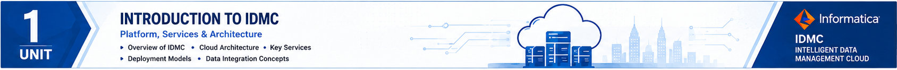
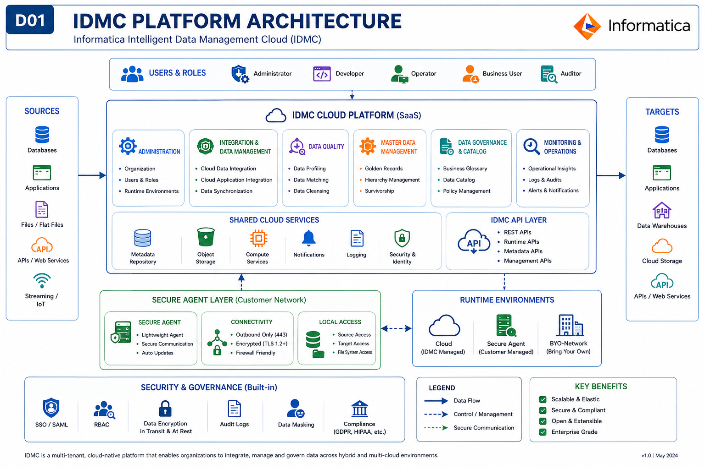

<p align="center">
  
</p>

# UNIT 1

# Student Notes
# UNIT 1 – STUDENT NOTES

# Informatica Intelligent Data Management Cloud (IDMC)

---

# Unit Overview

This unit introduces the concepts of Enterprise Data Management and Informatica Intelligent Data Management Cloud (IDMC). It explains why organizations require cloud-based data management platforms and provides an overview of the major IDMC services, including Cloud Data Integration (CDI), Cloud Application Integration (CAI), Cloud Data Quality (CDQ), Master Data Management (MDM), Cloud Data Governance & Catalog (CDGC), Cloud Integration Hub (CIH), and Cloud Data Marketplace (CDMP).

---

# Unit Learning Outcomes

After studying this unit, you should be able to:

- Explain the concept of Enterprise Data Management.
- Describe the need for cloud-based data management.
- Explain the architecture of Informatica Intelligent Data Management Cloud (IDMC).
- Differentiate CDI, CAI, CDQ, MDM, CDGC, CIH, and CDMP.
- Identify suitable IDMC services for different business scenarios.

---

# Chapter 1

# Enterprise Data Management

---

## Learning Objectives

After studying this topic, you should be able to:

- Explain Enterprise Data Management.
- Identify enterprise data challenges.
- Describe the need for integrated data management.

---

## Introduction

Modern organizations generate large volumes of data from multiple business systems such as Enterprise Resource Planning (ERP), Customer Relationship Management (CRM), Human Resource Management Systems (HRMS), finance applications, inventory systems, and cloud services.

Managing this data effectively is essential for informed decision-making, operational efficiency, and customer satisfaction.

---

## Definition

**Enterprise Data Management (EDM)** is the process of collecting, integrating, managing, governing, securing, and delivering trusted data across an organization to support business operations and strategic decision-making.

---

## Why Enterprise Data Management?

Organizations use multiple information systems.

Examples include:

- ERP
- CRM
- HRMS
- Finance
- Inventory
- Marketing
- Customer Support

Without proper management:

- Duplicate data occurs.
- Reports become inconsistent.
- Business decisions become unreliable.
- Data security becomes difficult.

Enterprise Data Management solves these problems by providing trusted and integrated data.

---

## Enterprise Data Flow

```
Business Applications

↓

Enterprise Data Management

↓

Trusted Information

↓

Business Intelligence

↓

Decision Making
```

---

## Advantages

- Improved data quality
- Better decision-making
- Faster reporting
- Enhanced customer experience
- Reduced duplication
- Improved compliance

---

## Enterprise Example

A retail company stores customer information in CRM, orders in ERP, inventory in warehouse systems, and payments in finance systems.

Enterprise Data Management integrates these systems to create a unified customer view for analytics and business operations.

---

## Remember

Enterprise Data Management is **not** just storing data.

It also includes:

- Integration
- Governance
- Quality
- Security
- Lifecycle Management

---

## Exam Tip

**Frequently Asked Question**

Explain Enterprise Data Management with a suitable example.

---

## Quick Revision

✔ Multiple systems

✔ Trusted data

✔ Better decisions

✔ Integration

✔ Governance

---

## Self-Assessment

1. What is Enterprise Data Management?
2. Why do organizations require Enterprise Data Management?
3. List four benefits of Enterprise Data Management.

---
---

# Chapter 2

# Evolution of Informatica and Introduction to IDMC

---

## Learning Objectives

After studying this chapter, you should be able to:

- Explain the evolution of Informatica.
- Describe why enterprise data management moved to the cloud.
- Explain what Informatica Intelligent Data Management Cloud (IDMC) is.
- Identify the major cloud services available in IDMC.

---

# Introduction

As organizations adopted cloud computing, traditional on-premises ETL tools became difficult to manage in hybrid and multi-cloud environments. Businesses required a cloud-native platform capable of integrating, governing, securing, and managing enterprise data across diverse systems.

To address these challenges, Informatica evolved from traditional ETL products to the Informatica Intelligent Data Management Cloud (IDMC).

---

# Evolution of Informatica

```
Traditional ETL

↓

PowerCenter

↓

Cloud Adoption

↓

Informatica Intelligent Cloud Services (IICS)

↓

Informatica Intelligent Data Management Cloud (IDMC)
```

### Explanation

**Traditional ETL**

- Data integration performed mainly on-premises.
- Limited cloud support.
- High infrastructure maintenance.

**PowerCenter**

- Enterprise ETL platform.
- Widely adopted for large-scale data integration.
- Primarily designed for on-premises environments.

**IICS (Informatica Intelligent Cloud Services)**

- First cloud-native Informatica platform.
- Supported cloud-based integration.
- Reduced infrastructure complexity.

**IDMC (Intelligent Data Management Cloud)**

- Unified AI-powered cloud platform.
- Supports data integration, application integration, governance, quality, master data management, and metadata management.

---

# Why Did Informatica Evolve?

Organizations experienced rapid growth in:

- Cloud applications
- SaaS platforms
- Hybrid cloud environments
- Big Data
- Artificial Intelligence
- Real-time analytics

Traditional ETL platforms could no longer efficiently manage these environments.

IDMC was developed to provide a unified cloud-based data management platform.

---

# What is IDMC?

**Informatica Intelligent Data Management Cloud (IDMC)** is an AI-powered cloud platform that enables organizations to integrate, manage, govern, protect, and analyze enterprise data across cloud, hybrid, and on-premises environments.

Unlike traditional software, IDMC consists of multiple cloud services working together.

---

# Major Services of IDMC

| Service | Purpose |
|---------|----------|
| CDI | Cloud Data Integration |
| CAI | Cloud Application Integration |
| CDQ | Cloud Data Quality |
| MDM | Master Data Management |
| CDGC | Cloud Data Governance & Catalog |
| CIH | Cloud Integration Hub |
| CDMP | Cloud Data Marketplace |

---

# Simplified IDMC Architecture
## Introduction to IDMC

<p align="center">

</p>

**Figure 1.1:** Informatica Intelligent Data Management Cloud (IDMC) Platform Architecture

```
Enterprise Applications

↓

IDMC Platform

├── CDI
├── CAI
├── CDQ
├── MDM
├── CDGC
├── CIH
└── CDMP

↓

Business Intelligence

↓

Decision Making
```

---

# Key Features of IDMC

- Cloud-native platform
- AI-powered automation
- Supports hybrid environments
- Enterprise-grade security
- Metadata-driven architecture
- Scalable integration
- Unified management

---

# Advantages

- Centralized enterprise data management
- Improved data quality
- Better governance
- Reduced integration complexity
- Faster analytics
- Support for cloud transformation

---

# Industrial Example

A multinational retail company uses:

- Salesforce CRM
- SAP ERP
- Snowflake Data Warehouse
- Oracle Database
- AWS S3 Storage

Instead of managing these systems independently, the company uses IDMC to integrate, govern, and manage enterprise data through a single cloud platform.

---

# Remember

**IDMC is a platform, not a single software application.**

Each cloud service performs a specific enterprise function while working together within the same platform.

---

# Comparison

| Traditional ETL | IDMC |
|-----------------|------|
| On-premises | Cloud-native |
| Limited scalability | Highly scalable |
| Separate tools | Unified platform |
| Manual administration | AI-assisted management |

---

# Exam Tips

### Frequently Asked University Questions

1. Explain the evolution of Informatica.
2. Define Informatica Intelligent Data Management Cloud.
3. Draw and explain the architecture of IDMC.
4. List the major services provided by IDMC.
5. Differentiate Traditional ETL and IDMC.

---

# Quick Revision

✔ Traditional ETL

↓

✔ PowerCenter

↓

✔ IICS

↓

✔ IDMC

Remember:

**IDMC = Unified Enterprise Data Management Platform**

---

# Frequently Asked Questions

### Q1. Is IDMC a database?

**Answer:**

No.

IDMC is a cloud platform providing multiple enterprise data management services.

---

### Q2. Can IDMC work with on-premises systems?

Yes.

IDMC supports cloud, hybrid, and on-premises environments.

---

### Q3. Why is IDMC preferred over traditional ETL?

Because it provides:

- Cloud-native architecture
- Better scalability
- Multiple integrated services
- AI-powered automation

---

# Practice Questions

## Multiple Choice

1. Which Informatica platform replaced IICS?

2. Which of the following is NOT an IDMC service?

3. Which platform is cloud-native?

---

## Short Answer

1. Define IDMC.
2. Explain two advantages of IDMC.
3. What is IICS?

---

## Descriptive Questions

1. Explain the evolution of Informatica with a suitable diagram.
2. Draw and explain the architecture of IDMC.
3. Discuss the importance of IDMC in enterprise data management.

---

# Chapter Summary

In this chapter, you learned:

- The evolution of Informatica from traditional ETL tools to IDMC.
- Why organizations moved to cloud-based data management.
- The definition and architecture of IDMC.
- The major cloud services available in the IDMC platform.
- The advantages of adopting IDMC for enterprise data management.
---

# Chapter 3

# Cloud Data Integration (CDI)

---

## Learning Objectives

After studying this chapter, you should be able to:

- Define Cloud Data Integration (CDI).
- Explain the purpose of CDI in enterprise environments.
- Differentiate ETL and ELT approaches.
- Describe the architecture of CDI.
- Explain the data integration workflow.
- Identify business scenarios where CDI is used.

---

# Introduction

Modern organizations store data in multiple locations such as cloud applications, databases, ERP systems, CRM platforms, and data warehouses. Since these systems operate independently, organizations require a reliable mechanism to integrate and synchronize their data.

Cloud Data Integration (CDI) is the Informatica IDMC service designed to solve this challenge.

---

# What is Cloud Data Integration?

**Cloud Data Integration (CDI)** is an Informatica Intelligent Data Management Cloud (IDMC) service that enables organizations to extract, transform, and load (ETL/ELT) data between cloud, on-premises, and hybrid environments.

It provides a scalable, cloud-native platform for integrating enterprise data from multiple heterogeneous sources into trusted target systems.

---

# Why is CDI Required?

Organizations face several challenges:

- Data stored in multiple systems
- Different database technologies
- Cloud and on-premises applications
- Duplicate information
- Delayed reporting
- Inconsistent analytics

CDI helps solve these problems by creating automated and reliable data integration workflows.

---

# CDI Architecture

```
           Source Systems

 Oracle   SQL Server   Salesforce

          SAP      CSV Files

                │

          Secure Agent

                │

       Mapping Designer

                │

     Transformations

                │

       Target Systems

 Snowflake   Azure SQL

 Amazon S3   Google BigQuery

                │

      Analytics Dashboard
```

---

# Components of CDI

## 1. Source Systems

The systems from which data is extracted.

Examples:

- Oracle Database
- SQL Server
- Salesforce
- SAP
- Flat Files
- REST APIs

---

## 2. Secure Agent

The Secure Agent executes integration tasks securely.

Responsibilities:

- Connects source systems
- Executes mappings
- Transfers data securely
- Communicates with IDMC

---

## 3. Mapping Designer

The graphical development environment used to design data integration workflows.

Developers can:

- Drag and drop objects
- Apply transformations
- Validate mappings
- Configure targets

---

## 4. Transformations

Transformations modify data before loading.

Common transformations include:

- Expression
- Filter
- Joiner
- Lookup
- Aggregator
- Router
- Sorter
- Sequence Generator

---

## 5. Target Systems

The destination where processed data is stored.

Examples:

- Snowflake
- Azure SQL
- Amazon Redshift
- Google BigQuery
- Data Lake

---

# ETL Process

ETL stands for:

**Extract → Transform → Load**

### Step 1 – Extract

Data is collected from multiple source systems.

### Step 2 – Transform

Data is cleaned, standardized, validated, and converted.

### Step 3 – Load

The transformed data is loaded into the target system.

---

# ETL Diagram

```
Source

↓

Extract

↓

Transform

↓

Load

↓

Data Warehouse
```

---

# ELT Process

ELT stands for:

**Extract → Load → Transform**

In cloud platforms, data is first loaded into the target system, and transformations are performed inside the cloud database.

---

# ETL vs ELT

| ETL | ELT |
|-----|-----|
| Transform before loading | Transform after loading |
| Suitable for traditional data warehouses | Suitable for cloud-native platforms |
| Processing on ETL server | Processing inside target platform |
| Moderate scalability | High scalability |

---

# Features of CDI

- Cloud-native integration
- Drag-and-drop development
- Metadata-driven design
- Large connector library
- Real-time and batch integration
- Monitoring and scheduling
- Scalable architecture

---

# Advantages of CDI

- Reduces manual integration effort
- Supports hybrid environments
- Improves reporting accuracy
- Enables enterprise analytics
- Automates recurring integration tasks
- Improves operational efficiency

---

# Limitations

- Requires proper source system connectivity
- Performance depends on network and infrastructure
- Complex integrations require careful design
- Secure Agent management is essential

---

# Enterprise Example

### Retail Company

Data Sources:

- Salesforce CRM
- Oracle ERP
- MySQL Inventory Database
- CSV Sales Files

Target:

Snowflake Data Warehouse

Workflow:

1. Extract customer, sales, and inventory data.
2. Apply transformations.
3. Remove duplicate records.
4. Standardize formats.
5. Load trusted data into Snowflake.
6. Generate Power BI dashboards.

---

# Remember

**CDI integrates data—not business workflows.**

If the objective is workflow automation between applications, use **Cloud Application Integration (CAI)**.

---

# Comparison: CDI vs Manual Integration

| Manual Integration | CDI |
|-------------------|-----|
| Manual scripts | Automated workflows |
| Difficult maintenance | Centralized management |
| Error-prone | Reliable execution |
| Limited scalability | Cloud scalable |

---

# Exam Tips

Frequently asked questions:

1. Define Cloud Data Integration.
2. Draw and explain the CDI architecture.
3. Explain ETL with a suitable diagram.
4. Differentiate ETL and ELT.
5. Explain the role of the Secure Agent.
6. Explain the Mapping Designer.

---

# Frequently Asked Questions

### Q1. Can CDI integrate cloud and on-premises systems?

Yes. CDI supports cloud, hybrid, and on-premises environments.

---

### Q2. Does CDI permanently store enterprise data?

No.

CDI performs extraction, transformation, and loading. Data remains in the source or target systems.

---

### Q3. Is Secure Agent mandatory?

Yes.

The Secure Agent executes integration tasks and securely connects enterprise systems with IDMC.

---

# Practice Questions

## Multiple Choice

1. What is the primary purpose of CDI?
2. Which component executes mappings?
3. What does ETL stand for?
4. Which transformation combines records from multiple sources?

---

## Short Answer

1. Define Cloud Data Integration.
2. Explain the role of Secure Agent.
3. Differentiate ETL and ELT.

---

## Descriptive Questions

1. Draw and explain the architecture of CDI.
2. Explain the ETL process with a suitable diagram.
3. Discuss the advantages of Cloud Data Integration.

---

## Scenario-Based Question

A university stores student information in Oracle Database, attendance in MySQL, and examination results in SQL Server. The administration wants a unified dashboard for academic analytics.

1. Why is data integration required?
2. Which IDMC service should be used?
3. Explain how CDI would solve this problem.

---

# Chapter Summary

In this chapter, you learned:

- The purpose of Cloud Data Integration (CDI)
- The architecture and components of CDI
- ETL and ELT concepts
- Enterprise data integration workflows
- The role of the Secure Agent
- Practical business applications of CDI

CDI is the foundation of enterprise data integration and enables organizations to combine data from diverse systems into trusted, analytics-ready information.
---

# Chapter 4

# Cloud Application Integration (CAI)

---

## Learning Objectives

After studying this chapter, you should be able to:

- Define Cloud Application Integration (CAI).
- Explain the need for application integration.
- Differentiate Cloud Data Integration (CDI) and Cloud Application Integration (CAI).
- Describe workflow automation.
- Explain event-driven integration.
- Identify enterprise use cases of CAI.

---

# Introduction

Modern enterprises use multiple software applications to perform business operations. These applications often belong to different vendors and platforms.

Examples include:

- Salesforce CRM
- SAP ERP
- Workday HRMS
- ServiceNow
- Microsoft Dynamics
- Oracle ERP
- Payment Gateway
- Inventory System

These applications must exchange information automatically to support business operations.

Cloud Application Integration (CAI) enables this communication.

---

# What is Cloud Application Integration?

Cloud Application Integration (CAI) is an Informatica Intelligent Data Management Cloud (IDMC) service that connects enterprise applications, automates workflows, orchestrates APIs, and enables real-time communication between cloud and on-premises applications.

Unlike CDI, which integrates data, CAI integrates business applications.

---

# Why is CAI Required?

Without application integration:

- Employees manually transfer information.
- Business processes become slow.
- Errors increase.
- Duplicate work occurs.
- Customer service is delayed.

CAI automates these processes, improving efficiency and reducing human intervention.

---

# Enterprise Business Scenario

### Online Shopping

A customer purchases a laptop from an e-commerce website.

The following applications are involved:

- Website
- Payment Gateway
- Inventory System
- ERP
- Warehouse Management
- Courier Service
- Customer Notification

Without integration, employees would manually update each application.

With CAI, all applications communicate automatically.

---

# CAI Workflow

```
Customer Order

↓

Website

↓

Payment Gateway

↓

Cloud Application Integration

↓

ERP

↓

Inventory

↓

Warehouse

↓

Courier

↓

Email / SMS Notification

↓

Customer
```

---

# How CAI Works

### Step 1

Customer places an order.

↓

### Step 2

Payment Gateway verifies payment.

↓

### Step 3

CAI triggers a workflow.

↓

### Step 4

ERP receives order information.

↓

### Step 5

Inventory is updated.

↓

### Step 6

Warehouse prepares shipment.

↓

### Step 7

Courier partner receives shipping request.

↓

### Step 8

Customer receives confirmation.

---

# Major Components of CAI

## Application Connectors

Provide connectivity with enterprise applications.

Examples:

- Salesforce
- SAP
- Oracle
- ServiceNow
- Microsoft Dynamics

---

## APIs

Allow applications to exchange information using standard web services.

Common API types:

- REST API
- SOAP API

---

## Workflow Engine

Controls the sequence of business activities.

Example:

Order Confirmation

↓

Invoice Generation

↓

Inventory Update

↓

Shipment

↓

Customer Notification

---

## Event Trigger

Starts a workflow automatically.

Example:

Payment Success

↓

Generate Invoice

↓

Update ERP

↓

Notify Customer

---

# Event-Driven Architecture

In traditional systems, users manually initiate every task.

Event-driven integration automatically starts workflows whenever an event occurs.

Examples of events:

- Customer registration
- Order placed
- Payment successful
- New employee joined
- Leave approved
- Invoice generated

---

# Features of CAI

- Real-time integration
- Workflow automation
- API orchestration
- Event-driven processing
- Cloud-native architecture
- Hybrid integration
- Visual workflow designer

---

# Advantages

- Eliminates manual work
- Faster business processes
- Real-time communication
- Better customer experience
- Reduced operational cost
- Improved productivity
- Supports digital transformation

---

# Limitations

- Requires proper API configuration
- Complex workflows require careful design
- Security policies must be enforced
- External system availability affects workflows

---

# CDI vs CAI

| Cloud Data Integration (CDI) | Cloud Application Integration (CAI) |
|------------------------------|-------------------------------------|
| Integrates data | Integrates applications |
| ETL / ELT processing | Workflow automation |
| Batch and scheduled execution | Real-time execution |
| Supports analytics | Supports business operations |
| Data movement | Process orchestration |

---

# Industrial Example

### Banking

When a customer applies for a personal loan:

Applications involved:

- Mobile Banking
- Credit Verification
- Loan Processing
- Core Banking
- SMS Gateway
- Email Server

CAI automatically coordinates communication between all applications until the loan request is processed.

---

# Healthcare Example

Patient books an appointment.

↓

Hospital Management System

↓

Doctor Scheduling

↓

Billing

↓

Insurance Verification

↓

SMS Reminder

↓

Patient

All communication is automated using application integration.

---

# Remember

**CDI integrates data.**

**CAI integrates applications.**

This is one of the most frequently asked interview and examination questions.

---

# Exam Tips

Frequently asked questions:

1. Define Cloud Application Integration.
2. Differentiate CDI and CAI.
3. Explain workflow automation.
4. Draw the CAI workflow.
5. Explain event-driven integration.

---

# Frequently Asked Questions

### Q1

Can CAI work with cloud and on-premises applications?

Yes.

CAI supports cloud, hybrid, and on-premises integration.

---

### Q2

Can CAI replace CDI?

No.

CDI integrates data, whereas CAI integrates applications and automates business processes.

---

### Q3

What triggers a workflow?

An event.

Examples include:

- Order placed
- Payment completed
- Employee registered
- Customer created

---

# Practice Questions

## Multiple Choice

1. Which IDMC service automates workflows?
2. What starts an event-driven workflow?
3. Which protocol is commonly used for web APIs?

---

## Short Answer

1. Define CAI.
2. Explain workflow automation.
3. What is event-driven integration?

---

## Descriptive Questions

1. Draw and explain the architecture of CAI.
2. Differentiate CDI and CAI.
3. Explain application integration with a suitable example.

---

## Scenario-Based Question

A university uses:

- Student Information System
- Library Management System
- Hostel Management System
- Fee Management System
- Learning Management System

Whenever a new student is admitted, all these systems must automatically receive student information.

Answer the following:

1. Which IDMC service should be used?
2. Explain how the workflow will execute.
3. What are the advantages of automating this process?

---

# Quick Revision

✔ Application Integration

✔ Workflow Automation

✔ Event-Driven Processing

✔ APIs

✔ Real-Time Communication

✔ Process Orchestration

---

# Chapter Summary

In this chapter, you learned:

- The purpose of Cloud Application Integration (CAI).
- The architecture and workflow of CAI.
- Event-driven processing and workflow automation.
- Differences between CDI and CAI.
- Enterprise applications of CAI.

CAI enables organizations to automate business processes by connecting enterprise applications and orchestrating workflows across cloud and on-premises environments.
---

# Chapter 5

# Cloud Data Quality (CDQ)

---

## Learning Objectives

After studying this chapter, you should be able to:

- Define Cloud Data Quality (CDQ).
- Explain the importance of data quality in enterprise systems.
- Describe the dimensions of data quality.
- Explain data profiling, cleansing, standardization, validation, and matching.
- Identify business scenarios where CDQ is used.

---

# Introduction

Organizations make business decisions based on data. If the data is inaccurate, incomplete, duplicated, or inconsistent, the resulting decisions can lead to financial loss, poor customer service, and compliance issues.

Cloud Data Quality (CDQ) helps organizations improve and maintain the quality of enterprise data before it is used for reporting, analytics, artificial intelligence, or operational processes.

---

# What is Cloud Data Quality?

**Cloud Data Quality (CDQ)** is an Informatica Intelligent Data Management Cloud (IDMC) service that enables organizations to profile, cleanse, validate, standardize, enrich, and monitor enterprise data to ensure that it is accurate, complete, consistent, and reliable.

---

# Why is Data Quality Important?

Poor-quality data can cause:

- Duplicate customer records
- Incorrect reports
- Failed marketing campaigns
- Billing errors
- Compliance violations
- Customer dissatisfaction
- Poor AI and machine learning predictions

High-quality data improves:

- Decision making
- Business intelligence
- Customer satisfaction
- Operational efficiency
- Regulatory compliance

---

# Data Quality Lifecycle

```
Raw Data

↓

Data Profiling

↓

Data Cleansing

↓

Standardization

↓

Validation

↓

Matching & Deduplication

↓

Trusted Enterprise Data
```

---

# Dimensions of Data Quality

## 1. Accuracy

Data should correctly represent real-world information.

**Example**

Customer Date of Birth is recorded correctly.

---

## 2. Completeness

All mandatory information should be available.

**Example**

Every customer record should contain:

- Name
- Phone Number
- Email Address

---

## 3. Consistency

The same information should be identical across all systems.

**Example**

Customer name should be the same in CRM and ERP.

---

## 4. Validity

Data should follow predefined business rules.

**Example**

Email address should follow the correct format.

```
name@example.com
```

---

## 5. Uniqueness

Duplicate records should not exist.

**Example**

One customer should have only one customer ID.

---

## 6. Timeliness

Data should be current and updated.

**Example**

The latest customer address should be available.

---

# Major CDQ Functions

## Data Profiling

Examines data to identify:

- Missing values
- Duplicate records
- Invalid formats
- Outliers
- Data distribution

---

## Data Cleansing

Corrects errors by:

- Removing duplicates
- Fixing spelling mistakes
- Correcting invalid values
- Filling missing information

---

## Data Standardization

Converts data into a consistent format.

Example:

```
Ramesh Kumar

R. Kumar

Ramesh K.

↓

Ramesh Kumar
```

---

## Data Validation

Checks whether data follows predefined business rules.

Example:

```
Age > 0

Email Format

Phone Number Length

Date Format
```

---

## Matching & Deduplication

Identifies records that represent the same entity.

Example:

```
Customer A

Customer A.

A Customer

↓

One Master Record
```

---

# CDQ Architecture

```
Source Systems

↓

Cloud Data Quality

├── Profile
├── Cleanse
├── Validate
├── Standardize
├── Match

↓

Trusted Enterprise Data

↓

Reporting / Analytics
```

---

# Enterprise Example

## Banking

Customer information is stored in:

- Savings Account System
- Credit Card System
- Loan System
- Internet Banking

Problems:

- Duplicate customer records
- Different addresses
- Invalid mobile numbers
- Missing PAN numbers

Using CDQ:

- Profile customer data
- Remove duplicates
- Validate formats
- Standardize addresses
- Produce trusted customer records

---

# Healthcare Example

Hospital records contain:

- Patient Registration
- Laboratory Reports
- Billing
- Pharmacy

CDQ ensures:

- Correct patient identification
- Consistent medical records
- Reduced treatment errors
- Better patient care

---

# Advantages of CDQ

- Improves data accuracy
- Reduces duplicate records
- Supports better analytics
- Enhances customer satisfaction
- Simplifies regulatory compliance
- Improves AI and machine learning performance

---

# Limitations

- Requires clearly defined business rules
- Needs continuous monitoring
- Cannot replace domain expertise
- Poor source data still requires correction

---

# Remember

**Garbage In = Garbage Out (GIGO)**

If poor-quality data enters an enterprise system, poor-quality reports and decisions will result.

---

# CDQ vs Manual Data Cleaning

| Manual Process | Cloud Data Quality |
|---------------|--------------------|
| Time-consuming | Automated |
| Error-prone | Consistent |
| Difficult to scale | Highly scalable |
| Manual validation | Rule-based validation |
| Limited monitoring | Continuous monitoring |

---

# Exam Tips

Frequently asked university questions:

1. Define Cloud Data Quality.
2. Explain the six dimensions of data quality.
3. Explain data profiling and data cleansing.
4. Differentiate validation and standardization.
5. Draw and explain the CDQ lifecycle.

---

# Frequently Asked Questions

### Q1. Is data profiling the same as data cleansing?

**Answer:**

No.

- Data profiling identifies problems.
- Data cleansing corrects problems.

---

### Q2. Can CDQ remove all data errors automatically?

No.

Many issues can be automated, but business rules and human review are often required.

---

### Q3. Why is data quality important before analytics?

Analytics is only as reliable as the underlying data. High-quality data leads to more accurate insights and better business decisions.

---

# Practice Questions

## Multiple Choice

1. Which IDMC service improves enterprise data quality?
2. Which data quality dimension removes duplicate records?
3. What is the purpose of data profiling?

---

## Short Answer

1. Define Cloud Data Quality.
2. List six dimensions of data quality.
3. Explain data standardization.

---

## Descriptive Questions

1. Explain the Cloud Data Quality lifecycle with a suitable diagram.
2. Discuss the importance of data quality in enterprise systems.
3. Explain data profiling, cleansing, validation, and matching with examples.

---

## Scenario-Based Question

A hospital maintains patient records in four different systems. Duplicate patient IDs and inconsistent contact information frequently cause treatment delays.

Answer the following:

1. Which IDMC service should be used?
2. Which data quality dimensions are affected?
3. Explain how CDQ can improve the quality of patient data.

---

# Quick Revision

✔ Cloud Data Quality

✔ Data Profiling

✔ Data Cleansing

✔ Standardization

✔ Validation

✔ Matching

✔ Trusted Data

---

# Chapter Summary

In this chapter, you learned:

- The purpose of Cloud Data Quality (CDQ).
- The six dimensions of data quality.
- The data quality lifecycle.
- The major functions of CDQ.
- Enterprise applications of CDQ.
- The importance of trusted data for analytics, AI, and business decision making.

Cloud Data Quality ensures that enterprise data is accurate, complete, consistent, valid, unique, and timely, enabling organizations to make informed decisions with confidence.
---

# Chapter 6

# Master Data Management (MDM)

---

## Learning Objectives

After studying this chapter, you should be able to:

- Define Master Data Management (MDM).
- Differentiate master data and transactional data.
- Explain the concept of a Single Source of Truth (SSOT).
- Describe Customer 360.
- Identify enterprise applications of MDM.
- Explain the benefits of MDM in improving data consistency and decision making.

---

# Introduction

Every enterprise stores information in multiple business systems such as CRM, ERP, Finance, HRMS, and Inventory. These systems often maintain separate copies of the same customer, supplier, or product information.

Without proper management, organizations experience duplicate records, inconsistent information, and unreliable reports.

Master Data Management (MDM) addresses these challenges by maintaining one trusted version of important business entities.

---

# What is Master Data Management?

**Master Data Management (MDM)** is an Informatica Intelligent Data Management Cloud (IDMC) service that creates, maintains, and governs a single, trusted version of critical business data across an organization.

The primary objective of MDM is to provide a **Single Source of Truth (SSOT)** for master data.

---

# What is Master Data?

Master Data refers to the core business entities that are shared across multiple applications and departments.

Common master data domains include:

- Customer
- Product
- Supplier
- Employee
- Vendor
- Location
- Asset

Unlike transactional data, master data changes infrequently but is used by many business processes.

---

# Master Data vs Transactional Data

| Master Data | Transactional Data |
|--------------|-------------------|
| Core business entities | Business activities or events |
| Changes infrequently | Changes continuously |
| Shared across departments | Specific to one transaction |
| Customer, Product, Supplier | Sales Order, Invoice, Payment |

---

# Why is MDM Required?

Without MDM:

- Duplicate customer records
- Different customer names in different systems
- Incorrect addresses
- Multiple customer IDs
- Poor customer service
- Inaccurate reports

With MDM:

- One trusted customer record
- Consistent information
- Better customer experience
- Improved analytics
- Reliable decision making

---

# Single Source of Truth (SSOT)

A **Single Source of Truth (SSOT)** means maintaining one authoritative and trusted version of master data that is shared across all enterprise applications.

```
CRM

↓

ERP

↓

Finance

↓

Marketing

↓

Customer Support

↓

Master Data Hub

↓

Single Trusted Customer Record
```

Every application refers to the same trusted information.

---

# Customer 360

Customer 360 is one of the most important applications of MDM.

Instead of maintaining separate customer records in different systems, Customer 360 creates a unified customer profile.

Example:

```
Customer

↓

Orders

↓

Payments

↓

Support Tickets

↓

Marketing Campaigns

↓

Loyalty Points

↓

Customer 360 Profile
```

This provides a complete view of customer interactions across the organization.

---

# MDM Architecture

```
Source Systems

CRM

ERP

Finance

Inventory

↓

Master Data Hub

↓

Match & Merge

↓

Golden Record

↓

Enterprise Applications
```

### Explanation

- **Source Systems** provide master data.
- **Master Data Hub** consolidates records.
- **Match & Merge** identifies duplicates.
- **Golden Record** becomes the trusted master record.
- Enterprise applications consume the trusted data.

---

# Golden Record

A **Golden Record** is the best and most accurate version of a master data entity created after matching, merging, and validating records from multiple systems.

Example:

```
CRM

Customer: Ramesh Kumar

↓

ERP

Customer: R. Kumar

↓

Support

Customer: Ramesh K.

↓

Golden Record

Customer: Ramesh Kumar
```

---

# Enterprise Example

## Retail Company

A customer purchases products through:

- Website
- Mobile App
- Physical Store
- Customer Support

Each system stores customer details separately.

Using MDM:

- Duplicate records are identified.
- Customer information is merged.
- One trusted customer profile is maintained.
- Marketing, sales, and support teams access the same information.

---

# Banking Example

A customer has:

- Savings Account
- Credit Card
- Home Loan
- Internet Banking

Without MDM:

- Multiple customer IDs
- Different addresses
- Duplicate records

With MDM:

- One customer profile
- Consistent KYC information
- Improved compliance
- Better customer service

---

# Benefits of MDM

- Single Source of Truth
- Better customer experience
- Improved reporting
- Reduced duplication
- Better regulatory compliance
- Improved AI and analytics
- Faster business decisions

---

# Limitations

- Requires governance policies
- Initial implementation may be complex
- Business rules must be carefully defined
- Continuous maintenance is required

---

# MDM Lifecycle

```
Collect Master Data

↓

Profile

↓

Match

↓

Merge

↓

Golden Record

↓

Govern

↓

Share Across Enterprise
```

---

# Remember

**MDM does not replace operational databases.**

It manages trusted master data and synchronizes it across enterprise systems.

---

# MDM vs CDQ

| MDM | CDQ |
|------|-----|
| Manages master data | Improves data quality |
| Creates Golden Record | Cleanses and validates data |
| Customer 360 | Data Profiling |
| Single Source of Truth | Trusted Data |

Both services complement each other.

---

# Exam Tips

Frequently asked university questions:

1. Define Master Data Management.
2. Differentiate Master Data and Transactional Data.
3. Explain Customer 360.
4. Explain Single Source of Truth.
5. Draw and explain the MDM architecture.
6. What is a Golden Record?

---

# Frequently Asked Questions

### Q1. Is MDM a database?

**Answer:**

No.

MDM is a process and platform for managing trusted master data. It works with existing databases rather than replacing them.

---

### Q2. What is the difference between Customer 360 and CRM?

**Answer:**

CRM manages customer interactions, while Customer 360 provides a unified, trusted view of customer information gathered from multiple systems.

---

### Q3. What is a Golden Record?

**Answer:**

A Golden Record is the most accurate, complete, and trusted version of a master data entity after matching and merging records from multiple systems.

---

# Practice Questions

## Multiple Choice

1. Which IDMC service creates a Single Source of Truth?
2. What is a Golden Record?
3. Which of the following is an example of master data?

---

## Short Answer

1. Define Master Data Management.
2. What is Customer 360?
3. Explain the concept of a Golden Record.

---

## Descriptive Questions

1. Explain the architecture of Master Data Management.
2. Differentiate Master Data and Transactional Data.
3. Discuss the importance of Single Source of Truth in enterprise systems.

---

## Scenario-Based Question

A multinational company stores customer information separately in CRM, ERP, Finance, and Customer Support systems. Different departments maintain different addresses and contact numbers for the same customer.

Answer the following:

1. Which IDMC service should be implemented?
2. Explain how MDM solves this problem.
3. What is the role of the Golden Record?
4. How does Customer 360 improve business operations?

---

# Quick Revision

✔ Master Data

✔ Golden Record

✔ Customer 360

✔ Single Source of Truth

✔ Match & Merge

✔ Master Data Hub

---

# Chapter Summary

In this chapter, you learned:

- The concept of Master Data Management (MDM).
- The difference between Master Data and Transactional Data.
- The importance of a Single Source of Truth.
- The role of Customer 360 and Golden Records.
- The architecture and lifecycle of MDM.
- Enterprise applications of MDM.

Master Data Management enables organizations to maintain trusted, consistent, and shared business information, forming the foundation for effective governance, analytics, customer experience, and enterprise decision making.
---

# Chapter 7

# Cloud Data Governance & Catalog (CDGC)

---

## Learning Objectives

After studying this chapter, you should be able to:

- Define Cloud Data Governance & Catalog (CDGC).
- Explain the importance of data governance in enterprise organizations.
- Describe metadata, data lineage, and data stewardship.
- Explain the role of a data catalog.
- Identify enterprise use cases of Cloud Data Governance.

---

# Introduction

Organizations collect and manage massive amounts of data. However, simply integrating and storing data is not sufficient. Organizations must know:

- What data exists?
- Where is it stored?
- Who owns it?
- Who can access it?
- Is it accurate and trustworthy?
- How has it changed over time?

Cloud Data Governance & Catalog (CDGC) provides answers to these questions.

---

# What is Cloud Data Governance & Catalog?

**Cloud Data Governance & Catalog (CDGC)** is an Informatica Intelligent Data Management Cloud (IDMC) service that enables organizations to discover, classify, catalog, govern, monitor, and manage enterprise data assets while ensuring compliance, security, and trust.

---

# Why is Data Governance Required?

Without governance:

- Sensitive data may be exposed.
- Duplicate datasets may exist.
- Data ownership becomes unclear.
- Compliance becomes difficult.
- Reports may use untrusted data.

With governance:

- Data ownership is clearly defined.
- Trusted datasets are identified.
- Regulatory compliance improves.
- Data usage becomes transparent.

---

# Data Governance Framework

```
Enterprise Data

↓

Discover

↓

Classify

↓

Catalog

↓

Govern

↓

Monitor

↓

Trusted Data Assets
```

---

# Major Components of CDGC

## 1. Data Discovery

Automatically identifies enterprise data assets from multiple systems.

Examples:

- Databases
- Data Warehouses
- Cloud Storage
- Applications

---

## 2. Metadata Management

Metadata is **data about data**.

Examples:

- Table Name
- Column Name
- Data Type
- Owner
- Last Modified Date

Metadata helps users understand the structure and meaning of enterprise data.

---

## 3. Data Catalog

A centralized repository containing information about enterprise data assets.

The catalog helps users:

- Search datasets
- Understand business definitions
- Identify data owners
- View technical metadata

---

## 4. Data Lineage

Data lineage shows the journey of data from its source to its destination.

```
Oracle Database

↓

Cloud Data Integration

↓

Snowflake

↓

Power BI Dashboard
```

Lineage helps answer:

- Where did the data originate?
- How was it transformed?
- Which reports use this data?

---

## 5. Data Stewardship

A **Data Steward** is responsible for maintaining the quality, consistency, and governance of enterprise data.

Typical responsibilities include:

- Approving data definitions
- Monitoring data quality
- Resolving data issues
- Ensuring compliance

---

# Governance Policies

Organizations define governance policies to ensure proper use of data.

Examples:

- Role-based access control
- Data retention policies
- Privacy policies
- Data classification rules
- Regulatory compliance (GDPR, HIPAA, etc.)

---

# CDGC Architecture

```
Enterprise Data Sources

↓

Metadata Discovery

↓

Cloud Data Governance & Catalog

├── Data Catalog
├── Metadata
├── Lineage
├── Stewardship
├── Governance Policies

↓

Trusted Enterprise Data

↓

Business Users
```

---

# Enterprise Example

## Healthcare

A hospital maintains:

- Patient Records
- Laboratory Reports
- Pharmacy Data
- Billing Information

Governance ensures:

- Only authorized doctors access patient records.
- Sensitive information is protected.
- Data lineage supports auditing.
- Compliance with healthcare regulations is maintained.

---

# Banking Example

A bank stores customer information in multiple systems.

Governance helps:

- Identify sensitive customer data.
- Protect account information.
- Track data movement.
- Meet regulatory requirements.
- Ensure trusted reporting.

---

# Benefits of CDGC

- Improved data trust
- Better compliance
- Enhanced security
- Improved collaboration
- Faster data discovery
- Better decision making
- Increased transparency

---

# Limitations

- Requires organizational policies.
- Needs active data stewardship.
- Governance processes must be maintained.
- Metadata should be updated regularly.

---

# Remember

**Data Governance is not only about security.**

It also includes:

- Ownership
- Quality
- Metadata
- Lineage
- Compliance
- Stewardship

---

# CDGC vs MDM

| MDM | CDGC |
|------|------|
| Manages master data | Governs all enterprise data |
| Creates Golden Records | Maintains metadata and governance |
| Customer 360 | Data Catalog |
| Single Source of Truth | Data Trust & Compliance |

Both services complement each other.

---

# Exam Tips

Frequently asked university questions:

1. Define Cloud Data Governance & Catalog.
2. Explain metadata with examples.
3. Explain data lineage.
4. What is a data catalog?
5. Differentiate MDM and CDGC.
6. Explain the role of a Data Steward.

---

# Frequently Asked Questions

### Q1. What is metadata?

**Answer:**

Metadata is information that describes data, such as table names, column names, data types, owners, and relationships.

---

### Q2. Why is data lineage important?

**Answer:**

Data lineage helps organizations understand where data originated, how it was transformed, and where it is used.

---

### Q3. Is governance only the responsibility of the IT department?

**Answer:**

No.

Governance involves business users, data owners, data stewards, compliance teams, and IT professionals.

---

# Practice Questions

## Multiple Choice

1. Which IDMC service provides enterprise data governance?
2. What is metadata?
3. Which component shows the flow of data?

---

## Short Answer

1. Define Cloud Data Governance.
2. Explain metadata.
3. What is data stewardship?

---

## Descriptive Questions

1. Explain the architecture of CDGC.
2. Discuss the importance of data governance.
3. Explain data lineage with a suitable diagram.

---

## Scenario-Based Question

A multinational company stores customer, financial, and HR data in multiple cloud platforms. The compliance team wants to know:

- Where sensitive data is stored.
- Who owns each dataset.
- How data flows from source to reports.
- Which users can access confidential information.

Answer the following:

1. Which IDMC service should be implemented?
2. Explain how CDGC addresses these requirements.
3. Why are metadata and data lineage important?

---

# Quick Revision

✔ Data Governance

✔ Metadata

✔ Data Catalog

✔ Data Lineage

✔ Data Steward

✔ Governance Policies

✔ Trusted Data

---

# Chapter Summary

In this chapter, you learned:

- The purpose of Cloud Data Governance & Catalog (CDGC).
- The importance of governance in enterprise data management.
- Metadata, data lineage, and data stewardship.
- The role of a data catalog.
- Enterprise applications of governance.

Cloud Data Governance & Catalog enables organizations to manage enterprise data responsibly by improving trust, compliance, transparency, and collaboration across the organization.
---

# Chapter 8

# Cloud Integration Hub (CIH) and Cloud Data Marketplace (CDMP)

---

## Learning Objectives

After studying this chapter, you should be able to:

- Define Cloud Integration Hub (CIH).
- Explain the Publish–Subscribe integration model.
- Describe the purpose of Cloud Data Marketplace (CDMP).
- Explain governed data sharing.
- Differentiate CIH and CDMP.
- Identify enterprise use cases of CIH and CDMP.

---

# Introduction

After data has been integrated, cleansed, standardized, and governed, organizations must distribute trusted data efficiently to multiple applications and business users.

Cloud Integration Hub (CIH) enables efficient data distribution, while Cloud Data Marketplace (CDMP) enables business users to discover and access trusted datasets through a governed self-service platform.

Together, these services improve enterprise collaboration and accelerate data-driven decision making.

---

# Cloud Integration Hub (CIH)

## What is CIH?

Cloud Integration Hub (CIH) is an Informatica Intelligent Data Management Cloud (IDMC) service that distributes trusted enterprise data using a **Publish–Subscribe architecture**, reducing complex point-to-point integrations.

Instead of connecting every application directly to every other application, data is published once and consumed by multiple subscribers.

---

# Why is CIH Required?

Without CIH:

- Multiple point-to-point integrations
- High maintenance effort
- Duplicate data movement
- Increased development cost
- Difficult scalability

With CIH:

- Publish once
- Consume many times
- Centralized data distribution
- Easier maintenance
- Better scalability

---

# Traditional Point-to-Point Integration

```
System A → System B

System A → System C

System A → System D

System B → System D

System C → System D
```

As the number of systems grows, integration becomes increasingly complex.

---

# Publish–Subscribe Architecture

```
              Cloud Integration Hub

                     │

      ┌──────────────┼──────────────┐

      │              │              │

   Sales         Marketing      Finance

      │              │              │

      └──────────────┼──────────────┘

                Analytics
```

The producer publishes trusted data once.

Multiple subscribers consume the same trusted data.

---

# CIH Workflow

```
Enterprise Data

↓

Cloud Data Integration

↓

Cloud Data Quality

↓

Master Data Management

↓

Cloud Integration Hub

↓

Sales

Marketing

Finance

Analytics

Mobile App
```

---

# Enterprise Example

## Retail Company

Trusted product information is published through CIH.

Subscribers include:

- E-commerce Website
- Mobile Application
- Marketing Team
- Sales Team
- Analytics Platform

Whenever product information changes, every subscriber automatically receives the updated information.

---

# Advantages of CIH

- Simplified integration
- Reduced maintenance
- Improved scalability
- Faster data distribution
- Consistent enterprise information
- Lower operational cost

---

# Cloud Data Marketplace (CDMP)

## What is CDMP?

Cloud Data Marketplace (CDMP) is an Informatica Intelligent Data Management Cloud (IDMC) service that enables business users to discover, request, and access certified enterprise datasets through a governed self-service marketplace.

---

# Why is CDMP Required?

Without CDMP:

- Users depend on IT teams.
- Duplicate datasets are created.
- Untrusted reports are generated.
- Data discovery is slow.

With CDMP:

- Self-service access
- Certified datasets
- Faster analytics
- Better governance
- Improved collaboration

---

# CDMP Workflow

```
Business User

↓

Search Dataset

↓

Certified Data Catalog

↓

Approval

↓

Access Granted

↓

Business Analytics
```

---

# Enterprise Example

## Marketing Department

Requirement:

Sales data for the last three years.

Without CDMP:

- Send email to IT.
- Wait for approval.
- Multiple versions of reports.

With CDMP:

- Search certified dataset.
- Request access.
- Manager approves.
- Download trusted dataset.
- Begin analysis immediately.

---

# CIH vs CDMP

| Cloud Integration Hub (CIH) | Cloud Data Marketplace (CDMP) |
|-----------------------------|-------------------------------|
| Distributes trusted data | Provides governed access to trusted datasets |
| Publish–Subscribe model | Self-service data discovery |
| System-to-System communication | User-to-Data interaction |
| Supports applications | Supports business users |

---

# CIH + CDMP Together

```
Enterprise Systems

↓

CDI

↓

CDQ

↓

MDM

↓

CDGC

↓

CIH

↓

Trusted Enterprise Data

↓

Cloud Data Marketplace

↓

Business Users

↓

Analytics & Decision Making
```

This architecture shows how trusted data flows from operational systems to business users through governed enterprise services.

---

# Advantages of CDMP

- Faster data discovery
- Reduced dependency on IT
- Certified datasets
- Improved governance
- Better collaboration
- Increased productivity

---

# Limitations

- Requires governance policies
- Requires metadata management
- User permissions must be maintained
- Dataset owners must keep information updated

---

# Remember

**CIH distributes trusted data.**

**CDMP helps users discover and access trusted data.**

Both services complement Cloud Data Governance.

---

# Exam Tips

Frequently asked university questions:

1. Define Cloud Integration Hub.
2. Explain Publish–Subscribe architecture.
3. Define Cloud Data Marketplace.
4. Differentiate CIH and CDMP.
5. Explain how CIH supports enterprise integration.

---

# Frequently Asked Questions

### Q1. Why is Publish–Subscribe better than point-to-point integration?

**Answer:**

Publish–Subscribe reduces the number of integration connections, making enterprise systems easier to maintain, scale, and manage.

---

### Q2. Does CDMP store enterprise data?

**Answer:**

No.

CDMP provides governed access to certified datasets. The actual data remains in enterprise storage systems.

---

### Q3. Who benefits from CDMP?

**Answer:**

Business analysts, data scientists, managers, auditors, and other authorized users who need trusted enterprise data.

---

# Practice Questions

## Multiple Choice

1. Which IDMC service uses the Publish–Subscribe model?
2. Which service enables self-service access to datasets?
3. Which service distributes trusted data to multiple applications?

---

## Short Answer

1. Define Cloud Integration Hub.
2. Define Cloud Data Marketplace.
3. Explain Publish–Subscribe architecture.

---

## Descriptive Questions

1. Explain the architecture of Cloud Integration Hub.
2. Differentiate CIH and CDMP.
3. Explain how CIH and CDMP support enterprise data management.

---

## Scenario-Based Question

A multinational retail company wants to:

- Publish trusted product information once.
- Share it with multiple business applications.
- Allow analysts to discover certified sales datasets without requesting data from the IT department.

Answer the following:

1. Which IDMC service should distribute the data?
2. Which IDMC service should provide self-service access?
3. Explain how these services improve enterprise efficiency.

---

# Quick Revision

✔ Publish–Subscribe

✔ Data Distribution

✔ Certified Dataset

✔ Self-Service Analytics

✔ Governed Data Sharing

✔ Enterprise Collaboration

---

# Chapter Summary

In this chapter, you learned:

- The purpose of Cloud Integration Hub (CIH).
- The Publish–Subscribe architecture.
- The role of Cloud Data Marketplace (CDMP).
- How trusted enterprise data is distributed and consumed.
- The relationship between CIH, CDMP, and Cloud Data Governance.

CIH and CDMP complete the enterprise data management lifecycle by ensuring that trusted data reaches the right applications and users in a secure, governed, and scalable manner.
---

# Chapter 9

# Unit Review, Quick Revision & Exam Preparation

---

# Unit Learning Summary

By completing this unit, you should be able to:

- Explain Enterprise Data Management.
- Describe the evolution of Informatica.
- Explain the architecture of IDMC.
- Differentiate all major IDMC services.
- Identify appropriate services for enterprise scenarios.
- Explain how enterprise data moves from operational systems to business intelligence.

---

# Complete IDMC Service Lifecycle

```
Enterprise Systems

↓

Cloud Data Integration (CDI)

↓

Cloud Data Quality (CDQ)

↓

Master Data Management (MDM)

↓

Cloud Data Governance & Catalog (CDGC)

↓

Cloud Integration Hub (CIH)

↓

Cloud Data Marketplace (CDMP)

↓

Analytics

↓

Artificial Intelligence

↓

Business Decisions
```

---

# Complete Service Comparison

| Service | Primary Purpose | Example |
|----------|-----------------|---------|
| CDI | Data Integration | Oracle → Snowflake |
| CAI | Application Integration | ERP ↔ CRM |
| CDQ | Improve Data Quality | Remove duplicate customers |
| MDM | Single Source of Truth | Customer 360 |
| CDGC | Governance & Metadata | Data Lineage |
| CIH | Publish–Subscribe Data Distribution | Product Information |
| CDMP | Self-Service Data Discovery | Certified Sales Dataset |

---

# Which Service Should I Use?

| Business Requirement | Informatica Service |
|----------------------|--------------------|
| Move data between databases | CDI |
| Automate business workflows | CAI |
| Remove duplicate records | CDQ |
| Create Customer 360 | MDM |
| Govern enterprise data | CDGC |
| Publish trusted data | CIH |
| Discover trusted datasets | CDMP |

---

# Enterprise Case Study

## ABC Retail Corporation

ABC Retail operates:

- Salesforce CRM
- SAP ERP
- Oracle Database
- Snowflake
- Marketing Platform
- Customer Support Portal

Business Requirements:

1. Integrate customer data.
2. Remove duplicate records.
3. Maintain one customer profile.
4. Govern sensitive customer information.
5. Share trusted data with departments.
6. Enable self-service analytics.

### Recommended Solution

| Requirement | Service |
|-------------|---------|
| Data Integration | CDI |
| Data Cleansing | CDQ |
| Customer 360 | MDM |
| Governance | CDGC |
| Data Distribution | CIH |
| Self-Service Analytics | CDMP |

---

# Concept Map

```
Enterprise Data

↓

Integration (CDI)

↓

Quality (CDQ)

↓

Master Data (MDM)

↓

Governance (CDGC)

↓

Distribution (CIH)

↓

Self-Service Access (CDMP)

↓

Business Intelligence

↓

Decision Making
```

---

# Glossary

| Term | Meaning |
|------|----------|
| ETL | Extract, Transform, Load |
| ELT | Extract, Load, Transform |
| Metadata | Data about data |
| Data Lineage | Flow of data from source to destination |
| Golden Record | Trusted master record |
| Customer 360 | Unified customer profile |
| SSOT | Single Source of Truth |
| Secure Agent | Executes CDI tasks |
| Publish–Subscribe | One publisher, multiple consumers |
| Data Steward | Person responsible for managing data quality and governance |

---

# Common Examination Mistakes

Avoid the following mistakes:

❌ Confusing CDI with CAI.

✔ CDI integrates **data**.

✔ CAI integrates **applications**.

---

❌ Confusing CDQ with MDM.

✔ CDQ improves data quality.

✔ MDM creates trusted master records.

---

❌ Assuming Governance means Security.

✔ Governance also includes:

- Metadata
- Ownership
- Lineage
- Stewardship
- Compliance

---

# Memory Tricks

Remember the IDMC workflow:

**I → Q → M → G → H → P**

Where:

- I = Integration (CDI)
- Q = Quality (CDQ)
- M = Master Data (MDM)
- G = Governance (CDGC)
- H = Hub (CIH)
- P = Marketplace (CDMP)

Think:

> **"Integrate Quality Master Governance Hub Platform."**

---

# Interview Preparation

### Question 1

Explain the complete IDMC architecture.

---

### Question 2

Differentiate CDI and CAI.

---

### Question 3

Explain Customer 360.

---

### Question 4

What is a Golden Record?

---

### Question 5

Explain Publish–Subscribe architecture.

---

### Question 6

Why is governance important for AI?

---

### Question 7

Explain the complete enterprise data lifecycle.

---

# Practice Questions

## Multiple Choice

1. Which IDMC service creates a Single Source of Truth?
2. Which service improves data quality?
3. Which service uses Publish–Subscribe architecture?
4. Which service supports workflow automation?
5. Which service provides metadata management?

---

## Short Answer

1. Define Enterprise Data Management.
2. Explain ETL.
3. Explain Customer 360.
4. What is Metadata?
5. Define Data Lineage.

---

## Descriptive Questions

1. Explain the evolution of Informatica.
2. Draw the architecture of IDMC.
3. Explain the lifecycle of enterprise data management.
4. Compare CDI and CAI.
5. Compare CDQ and MDM.
6. Explain the importance of Cloud Data Governance.
7. Explain Publish–Subscribe architecture.

---

## Scenario-Based Questions

### Scenario 1

A hospital wants to:

- Integrate patient records.
- Remove duplicate patient IDs.
- Create one patient profile.
- Govern medical records.
- Share trusted information with departments.

Recommend the appropriate IDMC services and justify your choices.

---

### Scenario 2

A bank stores customer data in CRM, ERP, Loan Management, and Internet Banking systems.

Explain how IDMC can provide:

- Trusted customer information
- Governance
- Analytics
- Better customer service

---

# Two-Minute Revision

Remember:

✔ Enterprise Data Management

↓

✔ IDMC

↓

✔ CDI

↓

✔ CAI

↓

✔ CDQ

↓

✔ MDM

↓

✔ CDGC

↓

✔ CIH

↓

✔ CDMP

↓

✔ Business Intelligence

↓

✔ Decision Making

---

# Key Takeaways

- Enterprise data must be integrated before it can be trusted.
- Data quality is essential for reliable analytics.
- Master Data Management creates a Single Source of Truth.
- Governance ensures compliance and trust.
- Cloud Integration Hub distributes trusted data efficiently.
- Cloud Data Marketplace enables self-service access to certified datasets.
- Together, these services form the Informatica Intelligent Data Management Cloud ecosystem.

---

# Unit Summary

Congratulations!

You have completed **Unit 1**.

You now understand:

- Enterprise Data Management
- Evolution of Informatica
- IDMC Architecture
- Cloud Data Integration (CDI)
- Cloud Application Integration (CAI)
- Cloud Data Quality (CDQ)
- Master Data Management (MDM)
- Cloud Data Governance & Catalog (CDGC)
- Cloud Integration Hub (CIH)
- Cloud Data Marketplace (CDMP)

These concepts form the foundation for the remaining units, where you will learn how to configure, administer, and use the Informatica Intelligent Data Management Cloud platform in real enterprise environments.