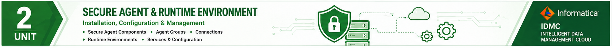

  

# UNIT 2

# Quiz (MCQs)

**Course Outcome:** CO2

**Total Questions:** 40

**Marks:** 40 × 1 = 40 Marks

---

## Question 1

Which is the highest administrative entity in Informatica Intelligent Cloud Services (IICS)?

A. User Group

B. Runtime Environment

C. Organization

D. Secure Agent

**Answer:** C

---

## Question 2

A Sub-Organization is created to:

A. Replace the parent organization

B. Improve administration of large enterprises

C. Execute mappings

D. Install Secure Agents

**Answer:** B

---

## Question 3

Who can create a Sub-Organization?

A. Developer

B. Operator

C. Organization Administrator

D. Business User

**Answer:** C

---

## Question 4

Which authentication method stores user credentials within IICS?

A. OAuth

B. Salesforce Authentication

C. Native Authentication

D. LDAP

**Answer:** C

---

## Question 5

Which authentication method supports Single Sign-On (SSO)?

A. Native Authentication

B. Salesforce Authentication

C. Anonymous Authentication

D. Local Authentication

**Answer:** B

---

## Question 6

Which feature verifies the identity of a user?

A. Authorization

B. Authentication

C. Encryption

D. Compression

**Answer:** B

---

## Question 7

Which of the following is NOT a user management activity?

A. Create User

B. Delete User

C. Configure Mapping

D. Reset Password

**Answer:** C

---

## Question 8

Which dashboard provides graphical representation of user activity?

A. Table View

B. List View

C. Chart View

D. Console View

**Answer:** C

---

## Question 9

Which view displays detailed records of users?

A. Chart View

B. List View

C. Dashboard View

D. Report View

**Answer:** B

---

## Question 10

User Groups are mainly used to:

A. Execute mappings

B. Organize users

C. Create Runtime Environments

D. Install Secure Agents

**Answer:** B

---

## Question 11

A user can belong to:

A. Only one User Group

B. Two User Groups only

C. Multiple User Groups

D. No User Group

**Answer:** C

---

## Question 12

User Roles primarily define:

A. User names

B. Permissions

C. Passwords

D. Licenses

**Answer:** B

---

## Question 13

RBAC stands for:

A. Runtime Based Access Control

B. Resource Based Application Control

C. Role-Based Access Control

D. Runtime Business Access Control

**Answer:** C

---

## Question 14

Which principle recommends granting only necessary permissions?

A. Separation of Duties

B. Principle of Least Privilege

C. Need-to-Know Principle

D. Open Access Principle

**Answer:** B

---

## Question 15

Which role normally has the highest administrative privileges?

A. Operator

B. Developer

C. Organization Administrator

D. Business User

**Answer:** C

---

## Question 16

A Runtime Environment is responsible for:

A. Designing database schema

B. Executing integration tasks

C. Creating organizations

D. Managing licenses

**Answer:** B

---

## Question 17

Which Runtime Environment requires no installation?

A. Secure Agent

B. Hosted Agent

C. Agent Manager

D. Agent Core

**Answer:** B

---

## Question 18

Which Runtime Environment is suitable for hybrid cloud integration?

A. Hosted Agent

B. Secure Agent

C. Local Agent

D. Browser Agent

**Answer:** B

---

## Question 19

Who manages the Hosted Agent?

A. Customer

B. Microsoft

C. Informatica

D. Database Administrator

**Answer:** C

---

## Question 20

Secure Agent is generally installed:

A. Only in Informatica Cloud

B. Inside the customer network

C. Inside Salesforce

D. On mobile devices

**Answer:** B
---

## Question 21

Which Secure Agent component is responsible for controlling and monitoring services?

A. Agent Core

B. Agent Manager

C. Runtime Engine

D. Connector Service

**Answer:** B

---

## Question 22

Which Secure Agent component performs the actual execution of integration jobs?

A. Agent Manager

B. Agent Core

C. Runtime Controller

D. Metadata Manager

**Answer:** B

---

## Question 23

Secure Agent communicates with Informatica Cloud primarily using:

A. FTP

B. HTTP

C. HTTPS

D. SMTP

**Answer:** C

---

## Question 24

Which of the following is NOT a major responsibility of Agent Manager?

A. Monitor services

B. Restart failed services

C. Execute mappings

D. Download updates

**Answer:** C

---

## Question 25

Which service performs mapping execution?

A. Agent Manager

B. Agent Core

C. User Manager

D. Runtime Monitor

**Answer:** B

---

## Question 26

The Secure Agent should ideally be installed on:

A. Every employee's laptop

B. A dedicated server

C. A student workstation

D. A public computer

**Answer:** B

---

## Question 27

Which account type is generally recommended for enterprise production environments?

A. Guest User

B. Local User

C. Network (Domain) User

D. Anonymous User

**Answer:** C

---

## Question 28

Which of the following is NOT a minimum requirement for Secure Agent?

A. Stable Internet Connection

B. Supported Operating System

C. 8 GB RAM

D. Graphics Card

**Answer:** D

---

## Question 29

Where can administrators verify whether a Secure Agent is online?

A. User Groups

B. Administrator → Runtime Environments

C. Asset Explorer

D. Connections Page

**Answer:** B

---

## Question 30

Which folder generally stores Secure Agent log files?

A. apps

B. temp

C. logs

D. downloads

**Answer:** C

---

## Question 31

A Secure Agent is showing **Offline** status. Which should be checked first?

A. PowerPoint version

B. Internet connectivity

C. Printer settings

D. Browser cache

**Answer:** B

---

## Question 32

Which of the following is a best practice for Secure Agent deployment?

A. Install all environments on one agent

B. Separate Development, Testing, and Production environments

C. Disable updates

D. Share administrator credentials

**Answer:** B

---

## Question 33

A company uses Salesforce and Oracle Database. Which Runtime Environment should be recommended?

A. Hosted Agent

B. Secure Agent

C. Browser Runtime

D. Mobile Runtime

**Answer:** B

---

## Question 34

Role-Based Access Control (RBAC) primarily improves:

A. Network speed

B. Data compression

C. Security and permission management

D. Disk utilization

**Answer:** C

---

## Question 35

Which statement about User Groups is TRUE?

A. They define user permissions.

B. They execute mappings.

C. They logically organize users.

D. They replace User Roles.

**Answer:** C

---

## Question 36

Which authentication method is most suitable for organizations using Salesforce as an identity provider?

A. Native Authentication

B. Salesforce Authentication

C. Manual Authentication

D. Guest Authentication

**Answer:** B

---

## Question 37

Which principle states that users should receive only the permissions necessary to perform their work?

A. Open Access Principle

B. Principle of Least Privilege

C. Maximum Access Principle

D. Shared Responsibility Principle

**Answer:** B

---

## Question 38

An administrator wants to view login trends graphically. Which feature should be used?

A. List View

B. Chart View

C. User Details

D. Runtime Logs

**Answer:** B

---

## Question 39

Which of the following best describes the relationship between User Groups and User Roles?

A. User Groups define permissions.

B. User Roles organize users.

C. User Groups organize users, while User Roles define permissions.

D. Both perform exactly the same function.

**Answer:** C

---

## Question 40

A multinational organization has offices in five countries and wants each regional office to manage its own users while maintaining centralized governance. Which IICS feature best supports this requirement?

A. Runtime Environments

B. Secure Agent

C. Sub-Organizations

D. Chart View

**Answer:** C

---

# Answer Key

| Q | Ans | Q | Ans | Q | Ans | Q | Ans |
|---|-----|---|-----|---|-----|---|-----|
| 1 | C | 11 | C | 21 | B | 31 | B |
| 2 | B | 12 | B | 22 | B | 32 | B |
| 3 | C | 13 | C | 23 | C | 33 | B |
| 4 | C | 14 | B | 24 | C | 34 | C |
| 5 | B | 15 | C | 25 | B | 35 | C |
| 6 | B | 16 | B | 26 | B | 36 | B |
| 7 | C | 17 | B | 27 | C | 37 | B |
| 8 | C | 18 | B | 28 | D | 38 | B |
| 9 | B | 19 | C | 29 | B | 39 | C |
| 10 | B | 20 | B | 30 | C | 40 | C |

---

# Quiz Coverage

| Topic | Questions |
|---------|:--------:|
| Organization & Sub-Organizations | 1–3, 40 |
| User Management & Authentication | 4–9, 36 |
| User Groups & User Roles | 10–15, 34, 35, 37, 39 |
| Runtime Environment | 16–20, 33 |
| Secure Agent | 21–32 |
| Enterprise Scenarios | 33, 40 |

---

# End of Quiz