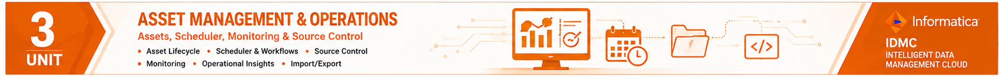

<p align="center">
  
</p>
# UNIT 3

# Faculty Notes

## Secure Agent Management, Performance Tuning, Asset Management and Monitoring

---

# Course Outcome (CO3)

Configure Secure Agent Groups, Runtime Services, Connections, Asset Management, Scheduling, Performance Optimization, and Monitoring capabilities in Informatica Intelligent Data Management Cloud (IDMC).

---

# Session 1

# Secure Agent Groups

Duration: 2 Hours

---

# Learning Objectives

After this session students should be able to:

- Explain Secure Agent Groups.
- Describe benefits of grouping multiple agents.
- View object dependencies.
- Enable and disable Secure Agent components.
- Explain enterprise deployment scenarios.

---

# Introduction

As enterprise environments grow, a single Secure Agent becomes insufficient to handle increasing workloads.

Organizations often deploy multiple Secure Agents across different locations or departments.

Managing them individually becomes complex.

To simplify administration, IDMC provides **Secure Agent Groups**, allowing multiple Secure Agents to work together as a logical unit.

---

# What is a Secure Agent Group?

A Secure Agent Group is a logical collection of multiple Secure Agents.

Instead of assigning jobs to an individual agent, administrators assign jobs to the group.

The runtime automatically selects an available agent.

---

# Why Secure Agent Groups?

Without Agent Groups:

- Single point of failure
- Uneven workload
- Poor scalability
- Difficult maintenance

With Agent Groups:

- Load balancing
- High availability
- Simplified administration
- Fault tolerance
- Better resource utilization

---

# Architecture

```

Cloud Data Integration

↓

Secure Agent Group

├── Agent 1

├── Agent 2

├── Agent 3

└── Agent 4

↓

Enterprise Resources

Oracle

SAP

SQL Server

REST APIs

```

---

# Benefits of Grouping Multiple Agents

## 1. High Availability

If one Secure Agent becomes unavailable, another agent in the group continues processing jobs.

---

## 2. Load Balancing

Jobs are distributed among multiple agents, reducing processing delays.

---

## 3. Improved Performance

Parallel execution enables faster processing of integration tasks.

---

## 4. Fault Tolerance

Agent failures do not interrupt business operations.

---

## 5. Scalability

Additional Secure Agents can be added without redesigning the architecture.

---

# Enterprise Example

ABC Bank operates in:

- Bangalore
- Mumbai
- Delhi
- Hyderabad

Instead of deploying one Secure Agent, each data center hosts a Secure Agent.

All four agents are combined into a Secure Agent Group.

Benefits:

- Automatic workload distribution
- Reduced downtime
- Increased availability

---

# Object Dependencies

Many assets depend upon other assets.

Examples include:

Mapping

↓

Connection

↓

Runtime Environment

↓

Secure Agent Group

When moving assets between environments, dependencies must also be transferred.

---

# Enable and Disable Components

Administrators can enable or disable components for:

- Maintenance
- Upgrades
- Troubleshooting
- Resource optimization

Typical components include:

- Data Integration
- Application Integration
- Process Server
- Metadata Service

---

# Demonstration

Demonstrate:

1. Open Administrator Console.
2. Navigate to Runtime Environments.
3. Create Secure Agent Group.
4. Add Secure Agents.
5. Verify Agent Status.
6. View Dependencies.

---

# Teaching Tips

Discuss:

"What happens if one Secure Agent fails during execution?"

Lead students toward concepts such as:

- High Availability
- Automatic Failover
- Load Balancing

---

# Classroom Discussion

Should every organization deploy multiple Secure Agents?

Discuss scenarios involving:

- Small organizations
- Large enterprises
- Hybrid cloud

---

# Lab Activity

Create a Secure Agent Group.

Add two Secure Agents.

Observe runtime selection.

Record observations.

---

# Interview Questions

1. What is a Secure Agent Group?

2. Why is load balancing important?

3. Explain High Availability.

4. How are jobs distributed?

5. What are Object Dependencies?

---

# Examination Questions

### 2 Marks

Define Secure Agent Group.

---

### 5 Marks

Explain benefits of Agent Groups.

---

### 10 Marks

Discuss Secure Agent Groups with suitable architecture and enterprise examples.

---

# Key Points

✔ Logical collection of Secure Agents

✔ Supports High Availability

✔ Supports Load Balancing

✔ Improves Scalability

✔ Simplifies Administration

---

# Summary

In this session students learned:

- Secure Agent Groups
- Benefits
- Architecture
- Object Dependencies
- Component Management
- Enterprise Deployment

---

# End of Session 1
# Session 2

# Working with Secure Agent

**Duration:** 2 Hours

---

# Learning Objectives

After completing this session, students will be able to:

- View Secure Agent details.
- Interpret Secure Agent statuses.
- Explain Secure Agent services.
- Configure upgrade settings.
- Monitor Secure Agent health.
- Apply best practices for enterprise administration.

---

# Introduction

Once a Secure Agent is installed, administrators must continuously monitor and maintain it to ensure reliable execution of integration jobs.

IDMC provides several administrative features to:

- Monitor Secure Agent health
- View runtime details
- Manage services
- Configure automatic upgrades
- Troubleshoot operational issues

Understanding these features helps administrators maintain a stable and secure integration environment.

---

# Viewing Secure Agent Details

Administrators can view detailed information about every Secure Agent from the **Administrator Console**.

Typical information includes:

- Agent Name
- Agent Group
- Runtime Environment
- Operating System
- Agent Version
- Installed Services
- Status
- Last Communication Time
- Upgrade Status

---

# How to View Secure Agent Details

1. Log in to IDMC.
2. Open **Administrator**.
3. Select **Runtime Environments**.
4. Choose the required Secure Agent.
5. Review the details displayed.

---

# Information Available

| Property | Description |
|-----------|-------------|
| Agent Name | Name of the Secure Agent |
| Version | Installed Secure Agent version |
| Status | Current operational state |
| Services | Installed runtime services |
| Runtime Environment | Assigned runtime |
| Last Communication | Last successful connection with IDMC |
| Upgrade Status | Current software version status |

---

# Secure Agent Statuses

The status indicates the operational condition of a Secure Agent.

Common statuses include:

### Running

- Agent is online.
- Ready to execute jobs.
- All required services are active.

---

### Starting

- Agent services are initializing.
- Temporary status after startup.

---

### Stopping

- Agent is shutting down.
- Running jobs may complete before termination.

---

### Stopped

- Agent services are not running.
- Jobs cannot execute.

---

### Offline

- Agent cannot communicate with IDMC.
- Possible network or system issue.

---

### Upgrading

- New version is being installed.
- Administrative actions may be temporarily unavailable.

---

# Status Lifecycle

```
Installed

↓

Starting

↓

Running

↓

Stopping

↓

Stopped

↓

Restart

↓

Running
```

---

# Secure Agent Services

A Secure Agent consists of multiple services working together.

Common services include:

- Data Integration Service
- Application Integration Service
- Process Server
- Metadata Service
- Connector Services
- Logging Service

Each service performs a specialized function.

---

# Service Responsibilities

| Service | Purpose |
|----------|---------|
| Data Integration | Executes mappings and synchronization tasks |
| Application Integration | Supports API and application workflows |
| Process Server | Executes process-based integrations |
| Metadata Service | Manages metadata communication |
| Connector Services | Connect to external systems |
| Logging Service | Stores execution logs |

---

# Service Health Monitoring

Administrators should regularly verify:

- Service status
- CPU utilization
- Memory usage
- Network connectivity
- Error logs
- Failed jobs

Monitoring these metrics helps detect issues before they affect production workloads.

---

# Upgrade Settings

Secure Agent supports software upgrades to provide:

- New features
- Security updates
- Bug fixes
- Performance improvements

Upgrade settings determine how these updates are applied.

---

# Upgrade Options

### Automatic Upgrade

- New versions are installed automatically.
- Recommended for development environments.

### Manual Upgrade

- Administrator controls upgrade timing.
- Preferred for production environments.

---

# Upgrade Best Practices

- Review release notes before upgrading.
- Perform upgrades during maintenance windows.
- Backup important configurations.
- Verify services after the upgrade.
- Test critical integration jobs.

---

# Enterprise Example

A financial institution operates Secure Agents in production.

To avoid business disruption:

- Automatic upgrades are disabled.
- Upgrades are tested in a staging environment.
- Production agents are upgraded only after successful validation.

This approach minimizes operational risk.

---

# Demonstration

Demonstrate the following:

1. Open Administrator Console.
2. Navigate to Runtime Environments.
3. Select a Secure Agent.
4. View agent properties.
5. Observe current status.
6. Review installed services.
7. Check upgrade settings.

---

# Troubleshooting Examples

| Problem | Possible Cause | Suggested Action |
|----------|----------------|------------------|
| Agent Offline | Network issue | Verify internet and firewall |
| Service Failed | Service crash | Restart Secure Agent service |
| Upgrade Failed | Interrupted download | Retry upgrade after checking connectivity |
| Jobs Not Running | Data Integration Service stopped | Restart the service |
| Frequent Disconnects | Unstable network | Verify network configuration |

---

# Teaching Tips

Ask students:

> "Why should production Secure Agents generally use manual upgrades instead of automatic upgrades?"

Encourage discussion around:

- Business continuity
- Change management
- Downtime planning
- Risk mitigation

---

# Classroom Discussion

Discuss the advantages and disadvantages of:

- Automatic upgrades
- Manual upgrades

Which approach is more appropriate for:

- Development environments?
- Testing environments?
- Production environments?

---

# Lab Activity

1. Open the Runtime Environment page.
2. View Secure Agent details.
3. Identify the status of each Secure Agent.
4. Review installed services.
5. Check upgrade settings.
6. Record observations.

---

# Interview Questions

1. What information is available in Secure Agent Details?
2. Explain different Secure Agent statuses.
3. What is the purpose of Data Integration Service?
4. Why are Secure Agent services monitored?
5. When should manual upgrades be preferred?

---

# Examination Questions

### 2 Marks

1. Define Secure Agent Status.
2. What is the purpose of Upgrade Settings?

---

### 5 Marks

1. Explain Secure Agent Services.
2. Differentiate Automatic and Manual Upgrades.

---

### 10 Marks

Explain the Secure Agent administration process, including agent details, statuses, services, upgrade settings, and troubleshooting.

---

# Key Points

✔ Secure Agent Details provide runtime information.

✔ Status indicates operational health.

✔ Multiple services work together to execute jobs.

✔ Upgrades improve functionality and security.

✔ Production upgrades should follow proper change management.

---

# Summary

In this session, students learned:

- Viewing Secure Agent Details
- Secure Agent Statuses
- Secure Agent Services
- Upgrade Settings
- Service Monitoring
- Enterprise Best Practices
- Troubleshooting

These concepts enable administrators to manage Secure Agents effectively and maintain reliable enterprise integration environments.

---

# End of Session 2
# Session 3

# Performance Tuning

**Duration:** 2 Hours

---

# Learning Objectives

After completing this session, students will be able to:

- Explain the importance of performance tuning.
- Configure Secure Agent Service Properties.
- Optimize the Data Integration Server.
- Describe the Serverless Runtime Environment.
- Identify common performance bottlenecks.
- Recommend enterprise performance optimization strategies.

---

# Introduction

Performance tuning is the process of optimizing the Secure Agent and Runtime Environment to achieve maximum efficiency, scalability, and reliability.

Poorly configured Secure Agents may result in:

- Slow mapping execution
- High CPU utilization
- Memory bottlenecks
- Long queue times
- Failed jobs

Proper tuning ensures efficient resource utilization and faster execution of integration tasks.

---

# What is Performance Tuning?

Performance tuning involves configuring runtime parameters to improve:

- Execution speed
- Resource utilization
- Scalability
- Throughput
- Reliability

The tuning process should be based on workload characteristics and available system resources.

---

# Performance Tuning Architecture

```
            Integration Job

                    │

          Secure Agent Runtime

                    │

    ┌───────────────┼───────────────┐

 CPU Configuration   Memory Allocation

 Thread Management   Connection Pool

                    │

          Optimized Execution

                    │

          Faster Job Completion
```

---

# Secure Agent Service Properties

Secure Agent Service Properties allow administrators to control how runtime services utilize system resources.

Common configurable properties include:

- Maximum Concurrent Jobs
- JVM Heap Size
- Thread Count
- Cache Size
- Temporary Directory
- Logging Level

Proper configuration improves stability and execution performance.

---

# Maximum Concurrent Jobs

This property determines the maximum number of integration jobs executed simultaneously.

### Low Value

- Lower CPU usage
- Lower memory usage
- Longer queue times

### High Value

- Faster throughput
- Higher CPU utilization
- Greater memory requirements

Administrators should select values based on server capacity.

---

# JVM Heap Size

The Java Virtual Machine (JVM) Heap Size controls the memory available to runtime services.

If the heap size is too small:

- OutOfMemory errors
- Frequent garbage collection
- Poor performance

If too large:

- Memory wastage
- Increased startup time

Balance is essential.

---

# Thread Management

Threads enable parallel processing.

Increasing thread count improves:

- Parallel execution
- Throughput

However, excessive threads may result in:

- Context switching
- CPU contention
- Reduced performance

---

# Logging Level

Logging assists in monitoring and troubleshooting.

Typical levels include:

- ERROR
- WARNING
- INFO
- DEBUG

Recommendations:

- Production → ERROR or WARNING
- Testing → INFO
- Development → DEBUG

---

# Data Integration Server

The Data Integration Server executes:

- Mappings
- Synchronization Tasks
- Data Replication
- Transformations

It is the core execution engine for Cloud Data Integration.

---

# Factors Affecting Performance

Performance depends on:

- CPU
- RAM
- Disk I/O
- Network latency
- Database response time
- Source system performance
- Target system performance

---

# Performance Optimization Techniques

Administrators should:

- Increase available memory.
- Reduce unnecessary logging.
- Optimize SQL queries.
- Minimize network latency.
- Configure appropriate concurrent job limits.
- Use efficient transformations.
- Schedule large jobs during off-peak hours.

---

# Serverless Runtime Environment

A Serverless Runtime Environment is a cloud-managed execution platform where infrastructure management is handled by Informatica.

Administrators focus on integration logic rather than server administration.

---

# Characteristics of Serverless Runtime

- No infrastructure management
- Automatic scaling
- Automatic updates
- Reduced operational overhead
- Elastic resource allocation

---

# Comparison: Secure Agent vs Serverless Runtime

| Feature | Secure Agent | Serverless Runtime |
|---------|--------------|-------------------|
| Installation | Required | Not Required |
| Infrastructure | Customer Managed | Informatica Managed |
| Scaling | Manual | Automatic |
| Maintenance | Customer | Informatica |
| On-Premises Access | Yes | Limited |
| Hybrid Integration | Excellent | Limited |

---

# Enterprise Example

A retail company executes thousands of integration jobs every day.

Initially:

- High CPU utilization
- Long job queues
- Frequent execution delays

After tuning:

- Increased JVM Heap Size
- Optimized concurrent jobs
- Reduced logging
- Scheduled batch jobs overnight

Results:

- 35% reduction in execution time
- Improved system stability
- Better resource utilization

---

# Demonstration

Perform the following:

1. Open Administrator Console.
2. Navigate to Runtime Environment.
3. Select Secure Agent.
4. View Service Properties.
5. Review JVM settings.
6. Observe concurrent job configuration.
7. Discuss tuning recommendations.

---

# Troubleshooting Performance Issues

| Problem | Possible Cause | Solution |
|----------|----------------|----------|
| Slow jobs | High server load | Reduce concurrent jobs or scale resources |
| OutOfMemory Error | Small JVM heap | Increase heap size |
| High CPU Usage | Excessive parallel jobs | Optimize thread count |
| Long Queue Times | Limited concurrent execution | Increase job concurrency carefully |
| Poor Database Performance | Slow SQL queries | Optimize database queries and indexes |

---

# Best Practices

- Monitor CPU and memory usage regularly.
- Tune one parameter at a time.
- Test changes in a non-production environment.
- Maintain baseline performance metrics.
- Schedule resource-intensive jobs during low-usage periods.
- Review performance reports periodically.

---

# Teaching Tips

Ask students:

> "Is increasing every performance parameter always beneficial?"

Guide them to understand the trade-offs between performance, stability, and resource availability.

---

# Classroom Discussion

Discuss:

"Would you recommend Serverless Runtime or Secure Agent for a multinational bank with strict data residency requirements?"

Encourage students to justify their recommendations.

---

# Lab Activity

1. Review Secure Agent Service Properties.
2. Identify configurable parameters.
3. Compare default and optimized settings.
4. Record expected performance improvements.

---

# Interview Questions

1. What is performance tuning?
2. Why is JVM Heap Size important?
3. What are concurrent jobs?
4. Explain Serverless Runtime Environment.
5. How would you improve Secure Agent performance?

---

# Examination Questions

### 2 Marks

1. Define Performance Tuning.
2. What is JVM Heap Size?
3. What is a Serverless Runtime Environment?

---

### 5 Marks

1. Explain Secure Agent Service Properties.
2. Compare Secure Agent and Serverless Runtime.

---

### 10 Marks

Explain performance tuning in IDMC, including Secure Agent configuration, Data Integration Server optimization, and Serverless Runtime Environment.

---

# Key Points

✔ Performance tuning improves execution efficiency.

✔ JVM Heap Size directly affects runtime stability.

✔ Concurrent job configuration influences throughput.

✔ Serverless Runtime reduces infrastructure management.

✔ Performance tuning should always be based on workload analysis.

---

# Summary

In this session, students learned:

- Performance Tuning
- Secure Agent Service Properties
- JVM Heap Size
- Concurrent Job Configuration
- Data Integration Server
- Serverless Runtime Environment
- Enterprise Optimization Techniques
- Troubleshooting and Best Practices

These concepts enable administrators to optimize runtime performance and ensure efficient enterprise data integration.

---

# End of Session 3
# Session 4

# Connections and File Transfer Settings

**Duration:** 2 Hours

---

# Learning Objectives

After completing this session, students will be able to:

- Explain the concept of Connections in IDMC.
- Differentiate between various IDMC Connectors.
- Configure cloud and on-premises connections.
- Describe File Transfer settings.
- Apply best practices for secure connection management.
- Troubleshoot common connection issues.

---

# Introduction

In any data integration platform, the first requirement is establishing a connection between the integration service and the source or target system.

IDMC uses **Connections** to securely communicate with databases, cloud applications, APIs, file systems, and enterprise applications.

Without a valid connection, integration tasks cannot read or write data.

---

# What is a Connection?

A **Connection** is a reusable object that stores all information required to communicate with an external system.

It contains:

- Connection Name
- Connector Type
- Authentication Information
- Host Details
- Port Number
- Database or Application Information
- Runtime Environment
- Security Configuration

Once created, the same connection can be reused across multiple mappings, tasks, and workflows.

---

# Connection Architecture

```
          IDMC

            │

      Connection Object

            │

     Secure Agent Runtime

            │

   ┌────────┼────────┐

 Database   Cloud App   File Server

 Oracle     Salesforce   FTP/SFTP

 SQL Server Workday      Amazon S3

 REST API   SAP          Local Files
```

---

# Why are Connections Important?

Connections provide:

- Secure communication
- Reusability
- Centralized configuration
- Easier maintenance
- Better governance

Instead of configuring connection details repeatedly, administrators create a reusable connection object.

---

# IDMC Connectors

A **Connector** is a software component that enables communication with a specific technology or application.

Examples include:

### Database Connectors

- Oracle
- SQL Server
- MySQL
- PostgreSQL
- Snowflake

---

### Cloud Connectors

- Salesforce
- Workday
- ServiceNow
- Microsoft Dynamics
- SAP Cloud

---

### File Connectors

- Flat File
- FTP
- SFTP
- Amazon S3
- Azure Blob Storage
- Google Cloud Storage

---

### Enterprise Connectors

- SAP
- REST API
- SOAP Web Services
- Kafka
- JMS

---

# Connector Categories

| Category | Examples |
|-----------|----------|
| Relational Databases | Oracle, SQL Server, MySQL |
| Cloud Applications | Salesforce, Workday |
| Enterprise Applications | SAP, ServiceNow |
| File Systems | FTP, SFTP, S3 |
| APIs | REST, SOAP |

---

# Connection Configuration

General steps for creating a connection:

1. Open **Administrator Console**.
2. Navigate to **Connections**.
3. Click **New Connection**.
4. Select Connector Type.
5. Enter connection details.
6. Assign Runtime Environment.
7. Test the connection.
8. Save the connection.

---

# Typical Connection Parameters

| Parameter | Description |
|-----------|-------------|
| Connection Name | Unique identifier |
| Connector Type | Oracle, Salesforce, etc. |
| Host | Server name or IP |
| Port | Communication port |
| Username | Login account |
| Password | Authentication credential |
| Database/Service | Target database or application |
| Runtime Environment | Hosted or Secure Agent |

---

# Commonly Used Connections

## Oracle Database

Required:

- Host
- Port
- Service Name
- Username
- Password
- Secure Agent

---

## SQL Server

Required:

- Server Name
- Database Name
- Authentication
- Runtime Environment

---

## Salesforce

Required:

- Username
- Password
- Security Token
- OAuth (if applicable)

---

## REST API

Required:

- Endpoint URL
- HTTP Method
- Authentication
- Headers

---

## Amazon S3

Required:

- Bucket Name
- Access Key
- Secret Key
- Region

---

# File Transfer Settings

File transfer allows Secure Agent to exchange files with local or remote systems.

Supported methods include:

- Local File System
- FTP
- SFTP
- Amazon S3
- Azure Blob Storage

Typical operations:

- Upload
- Download
- Copy
- Archive
- Delete

---

# Best Practices

- Use encrypted communication (HTTPS/SFTP).
- Store credentials securely.
- Reuse existing connections whenever possible.
- Test every connection before deployment.
- Assign the correct Runtime Environment.
- Follow the Principle of Least Privilege.

---

# Enterprise Example

A retail company integrates:

- Oracle ERP
- Salesforce CRM
- Amazon S3
- REST APIs

Instead of creating separate credentials for every mapping, reusable connections are created and shared across multiple integration projects.

Benefits include:

- Reduced configuration effort
- Improved security
- Simplified maintenance

---

# Demonstration

Perform the following:

1. Open Administrator Console.
2. Navigate to **Connections**.
3. Create an Oracle Connection.
4. Test the connection.
5. Create a Salesforce Connection.
6. Configure an SFTP Connection.
7. Review Runtime Environment selection.

---

# Troubleshooting

| Problem | Possible Cause | Solution |
|----------|----------------|----------|
| Connection Failed | Incorrect credentials | Verify username and password |
| Database Unreachable | Network issue | Check host, port, firewall |
| Authentication Error | Invalid token | Regenerate authentication token |
| Timeout | Slow network | Increase timeout and verify connectivity |
| Runtime Error | Wrong Runtime Environment | Select the correct Secure Agent |

---

# Teaching Tips

Ask students:

> "Why should organizations create reusable connections instead of entering credentials in every mapping?"

Encourage discussion on:

- Security
- Reusability
- Governance
- Maintainability

---

# Classroom Discussion

Discuss the advantages and disadvantages of:

- Database Connections
- Cloud Application Connections
- API Connections
- File-Based Connections

Which connector type would be most suitable for:

- Banking?
- Healthcare?
- E-commerce?

---

# Lab Activity

1. Create an Oracle Connection.
2. Test the connection.
3. Create a Salesforce Connection.
4. Configure an SFTP Connection.
5. Document the required parameters.
6. Compare Hosted and Secure Runtime selection.

---

# Interview Questions

1. What is a Connection in IDMC?
2. What is the difference between a Connection and a Connector?
3. Why should connections be reusable?
4. Explain Runtime Environment selection during connection configuration.
5. How would you troubleshoot a failed database connection?

---

# Examination Questions

### 2 Marks

1. Define a Connection.
2. What is a Connector?
3. Name two commonly used IDMC connectors.

---

### 5 Marks

1. Explain the steps involved in creating a Connection.
2. Discuss the different categories of IDMC Connectors.

---

### 10 Marks

Explain Connections and Connectors in IDMC, including configuration steps, file transfer settings, enterprise applications, and troubleshooting techniques.

---

# Key Points

✔ A Connection stores communication details for external systems.

✔ Connectors enable communication with specific technologies.

✔ Connections are reusable across multiple assets.

✔ File transfer supports FTP, SFTP, cloud storage, and local files.

✔ Always test connections before deployment.

---

# Summary

In this session, students learned:

- Connections
- IDMC Connectors
- Connection Configuration
- Commonly Used Connections
- File Transfer Settings
- Best Practices
- Troubleshooting

These concepts form the foundation for integrating IDMC with enterprise databases, cloud applications, APIs, and file systems.

---

# End of Session 4
# Session 5

# Asset Management and Source Control

**Duration:** 2 Hours

---

# Learning Objectives

After completing this session, students will be able to:

- Explain Assets in IDMC.
- Classify different types of assets.
- Manage assets throughout their lifecycle.
- Configure privileges and permissions.
- Enable and configure Source Control.
- Apply best practices for enterprise asset governance.

---

# Introduction

Everything created in Informatica Intelligent Data Management Cloud (IDMC) is stored as an **Asset**.

Examples include:

- Connections
- Mappings
- Mapping Tasks
- Workflows
- Schedules
- Runtime Environments
- Secure Agent Configurations

Proper asset management ensures maintainability, security, collaboration, and governance across enterprise integration projects.

---

# What is an Asset?

An **Asset** is any reusable object created within IDMC.

Assets can represent:

- Integration logic
- Configuration
- Metadata
- Scheduling information
- Administrative settings

Assets are reusable and can be shared across projects.

---

# Asset Architecture

```
                IDMC Organization

                       │

                 Project / Folder

                       │

     ┌──────────┬──────────┬──────────┐

 Connections  Mappings  Tasks  Workflows

                       │

                  Runtime Assets

                       │

               Secure Agent Group
```

---

# Common Asset Types

| Asset Type | Purpose |
|------------|---------|
| Connection | Connect to external systems |
| Mapping | Define data transformation logic |
| Mapping Task | Execute mappings |
| Workflow | Orchestrate multiple tasks |
| Schedule | Automate execution |
| Runtime Environment | Execute integration jobs |
| Secure Agent | Communicate with enterprise systems |

---

# Asset Lifecycle

Every asset typically follows this lifecycle:

```
Create

↓

Develop

↓

Test

↓

Deploy

↓

Maintain

↓

Archive

↓

Delete
```

---

# Managing Assets

Administrators can perform the following operations:

- Create
- View
- Edit
- Copy
- Move
- Rename
- Export
- Import
- Archive
- Delete

Proper asset management simplifies maintenance and improves collaboration.

---

# Organizing Assets

Recommended practices include:

- Create project-specific folders.
- Use meaningful naming conventions.
- Separate Development, Testing, and Production assets.
- Group related assets together.
- Archive obsolete assets.

---

# Privileges and Permissions

Asset security is controlled using permissions.

Permissions determine what actions a user can perform on an asset.

Common permission levels include:

- Read
- Create
- Modify
- Execute
- Delete
- Share
- Manage

---

# Role-Based Permissions

| Role | Typical Permissions |
|------|---------------------|
| Organization Administrator | Full Control |
| Developer | Create, Modify, Execute |
| Operator | Execute, Monitor |
| Business User | Read Only |
| Auditor | View Reports |

---

# Why Permissions Matter

Proper permissions help:

- Protect critical assets
- Prevent accidental modifications
- Support compliance
- Improve accountability
- Enforce governance

---

# Source Control

Source Control tracks changes made to assets.

It enables:

- Version history
- Collaboration
- Rollback
- Audit trail

In enterprise projects, Source Control integrates IDMC with systems such as Git.

---

# Source Control Workflow

```
Create Asset

↓

Modify Asset

↓

Commit Changes

↓

Version Repository

↓

Review

↓

Deploy
```

---

# Benefits of Source Control

- Version management
- Team collaboration
- Rollback capability
- Audit history
- Controlled deployment

---

# Configuring Source Control

General steps:

1. Open **Administrator Console**.
2. Navigate to **Source Control Settings**.
3. Configure repository details.
4. Authenticate.
5. Enable Source Control.
6. Assign permissions.
7. Save configuration.

---

# Enterprise Example

A software company has:

- 20 Developers
- 10 Test Engineers
- 5 Administrators

Developers create mappings and commit changes to Git.

Test Engineers validate new versions.

Administrators approve deployment to production.

Benefits:

- Version tracking
- Team collaboration
- Controlled deployment
- Easy rollback

---

# Demonstration

Perform the following:

1. Open Administrator Console.
2. Navigate to Assets.
3. Create a sample folder.
4. Create a Connection asset.
5. Assign permissions.
6. Enable Source Control.
7. Verify repository configuration.

---

# Best Practices

- Follow consistent naming conventions.
- Apply the Principle of Least Privilege.
- Organize assets into folders.
- Enable Source Control for all development projects.
- Review permissions periodically.
- Archive obsolete assets instead of deleting them immediately.

---

# Troubleshooting

| Problem | Possible Cause | Solution |
|----------|----------------|----------|
| User cannot edit asset | Insufficient permission | Assign Modify permission |
| Asset not visible | Folder restriction | Verify folder permissions |
| Source Control unavailable | Repository not configured | Configure repository settings |
| Version conflict | Concurrent modifications | Merge changes and resolve conflicts |
| Accidental deletion | Missing backup | Restore from repository/version history |

---

# Teaching Tips

Ask students:

> "Why should organizations use Source Control even when only a few developers are working on a project?"

Discuss:

- Collaboration
- Backup
- Version history
- Auditability

---

# Classroom Discussion

Discuss the advantages and disadvantages of:

- Manual asset management
- Source-controlled asset management

Should every enterprise integration project use Source Control? Why?

---

# Lab Activity

1. Create a sample asset.
2. Organize it into a folder.
3. Assign permissions.
4. Enable Source Control.
5. Record the configuration steps.
6. Discuss how version control improves collaboration.

---

# Interview Questions

1. What is an Asset in IDMC?
2. Explain the Asset Lifecycle.
3. Why are permissions important?
4. What are the advantages of Source Control?
5. How does Source Control support collaboration?

---

# Examination Questions

### 2 Marks

1. Define Asset.
2. What is Source Control?
3. State two benefits of Asset Management.

---

### 5 Marks

1. Explain the Asset Lifecycle.
2. Discuss Privileges and Permissions in IDMC.

---

### 10 Marks

Explain Asset Management in IDMC, including asset types, permissions, Source Control configuration, enterprise applications, and best practices.

---

# Key Points

✔ Assets are reusable objects within IDMC.

✔ Proper organization improves maintainability.

✔ Permissions protect enterprise resources.

✔ Source Control enables version management and collaboration.

✔ Asset governance is essential for enterprise deployments.

---

# Summary

In this session, students learned:

- Asset Management
- Asset Types
- Asset Lifecycle
- Managing Assets
- Privileges and Permissions
- Source Control
- Enterprise Governance
- Best Practices

Effective asset management ensures secure, organized, and maintainable enterprise integration projects while supporting collaboration and version control.

---

# End of Session 5
# Session 6

# Asset Management CLI, Bundle Management and Scheduling

**Duration:** 2 Hours

---

# Learning Objectives

After completing this session, students will be able to:

- Explain the Asset Management CLI Utility.
- Import and export assets using both the UI and CLI.
- Explain Bundle Management.
- Create and manage schedules.
- Use the RunAJob Utility.
- Apply deployment best practices.

---

# Introduction

Enterprise integration projects often contain hundreds of assets that must be moved between Development, Testing, UAT, and Production environments.

Performing these tasks manually is time-consuming and error-prone.

IDMC provides several utilities to automate deployment and execution:

- Asset Management CLI
- Asset Import & Export
- Bundle Management
- Scheduling
- RunAJob Utility

These tools simplify administration and support DevOps practices.

---

# Asset Management CLI Utility

The **Asset Management Command Line Interface (CLI)** enables administrators to manage IDMC assets from the command line.

Unlike the graphical user interface (GUI), the CLI supports automation, scripting, and batch operations.

Typical operations include:

- Import assets
- Export assets
- List assets
- Delete assets
- Update assets
- Deploy assets

---

# Advantages of CLI

Compared to manual administration, the CLI offers:

- Automation
- Faster deployment
- Batch processing
- Integration with CI/CD pipelines
- Reduced human error

---

# CLI Architecture

```
Administrator

      │

Asset Management CLI

      │

Authentication

      │

IDMC Repository

      │

Assets
```

---

# Asset Import

Importing assets transfers existing assets into an IDMC organization.

Typical import sources include:

- ZIP packages
- Exported bundles
- Development environments
- Backup repositories

---

# Asset Export

Exporting assets creates reusable deployment packages.

Exported assets may be used for:

- Backup
- Migration
- Disaster Recovery
- Environment Promotion

---

# Import and Export Workflow

```
Development

↓

Export Assets

↓

Bundle Package

↓

Import Assets

↓

Testing

↓

Production
```

---

# Demonstration

Demonstrate:

1. Export assets from Development.
2. Save ZIP package.
3. Import package into Testing.
4. Verify imported assets.
5. Execute mapping.

---

# Bundle Management

A **Bundle** is a collection of related assets packaged together for deployment.

A typical bundle may include:

- Connections
- Mappings
- Tasks
- Workflows
- Schedules

Bundles simplify deployment and ensure dependencies are transferred together.

---

# Bundle Lifecycle

```
Create Bundle

↓

Validate Dependencies

↓

Export

↓

Import

↓

Deploy

↓

Verify
```

---

# Benefits of Bundle Management

- Faster deployment
- Dependency management
- Easier migration
- Consistent releases
- Simplified rollback

---

# Schedules

A **Schedule** automates execution of integration jobs.

Instead of manually running tasks, administrators define execution times.

Scheduling supports:

- Daily jobs
- Weekly jobs
- Monthly jobs
- Event-based execution

---

# Schedule Components

A schedule typically contains:

- Schedule Name
- Start Date
- End Date
- Frequency
- Time Zone
- Runtime Environment
- Notification Settings

---

# Types of Schedules

| Type | Example |
|------|---------|
| Once | Initial data migration |
| Daily | Nightly ETL job |
| Weekly | Weekly reporting |
| Monthly | Payroll processing |
| Custom | Every 4 hours |

---

# Schedule Workflow

```
Create Schedule

↓

Assign Task

↓

Specify Frequency

↓

Save

↓

Automatic Execution
```

---

# RunAJob Utility

The **RunAJob Utility** allows administrators to execute integration jobs programmatically.

It is commonly used for:

- Automation
- Batch execution
- External scheduling
- CI/CD integration

RunAJob supports enterprise automation by eliminating manual intervention.

---

# Enterprise Example

A retail organization executes:

- Customer Synchronization
- Inventory Updates
- Sales Reporting

Daily Process:

- 12:00 AM → Inventory Update
- 2:00 AM → Customer Synchronization
- 5:00 AM → Sales Report Generation

All jobs are scheduled automatically using IDMC Scheduling.

Deployment to production occurs through Bundles managed by the Asset Management CLI.

---

# Best Practices

- Export assets before major changes.
- Validate dependencies before deployment.
- Maintain versioned bundles.
- Test imported assets.
- Use schedules instead of manual execution whenever possible.
- Document CLI commands used in production.

---

# Troubleshooting

| Problem | Possible Cause | Solution |
|----------|----------------|----------|
| Import Failed | Missing dependency | Export all dependent assets |
| Bundle Error | Invalid asset references | Validate bundle contents |
| Schedule Not Running | Incorrect time zone | Verify schedule settings |
| CLI Authentication Failed | Invalid credentials | Re-authenticate |
| RunAJob Failed | Runtime unavailable | Verify Secure Agent status |

---

# Teaching Tips

Ask students:

> "Why do large organizations prefer automated deployment using CLI instead of manually importing assets?"

Discuss:

- DevOps
- Repeatability
- Automation
- Human error reduction

---

# Classroom Discussion

Discuss:

Should production deployments always use Bundles?

What are the risks of manually copying assets?

---

# Lab Activity

1. Export selected assets.
2. Import assets into another project.
3. Create a Bundle.
4. Configure a Schedule.
5. Execute a task using RunAJob.
6. Verify execution status.

---

# Interview Questions

1. What is the Asset Management CLI?
2. Why are Bundles used?
3. Explain the difference between Import and Export.
4. What is the purpose of Scheduling?
5. What is the RunAJob Utility?

---

# Examination Questions

### 2 Marks

1. Define Bundle Management.
2. What is the RunAJob Utility?
3. What is an Asset Management CLI?

---

### 5 Marks

1. Explain Asset Import and Export.
2. Discuss Scheduling in IDMC.

---

### 10 Marks

Explain Asset Management CLI, Bundle Management, Scheduling, and RunAJob Utility with suitable workflow diagrams and enterprise examples.

---

# Key Points

✔ CLI supports automation.

✔ Bundles simplify deployment.

✔ Scheduling automates execution.

✔ RunAJob enables programmatic execution.

✔ Enterprise deployments should use version-controlled bundles.

---

# Summary

In this session, students learned:

- Asset Management CLI
- Asset Import
- Asset Export
- Bundle Management
- Scheduling
- RunAJob Utility
- Enterprise Deployment
- Best Practices

These tools enable automated, repeatable, and reliable deployment of IDMC assets across enterprise environments.

---

# End of Session 6
# Session 7

# Monitoring Tasks and Operational Insights

**Duration:** 2 Hours

---

# Learning Objectives

After completing this session, students will be able to:

- Explain monitoring in IDMC.
- Describe Event Monitoring.
- Monitor job execution status.
- Understand File Server monitoring.
- Analyze Operational Insights dashboards.
- Identify and troubleshoot failed integration jobs.

---

# Introduction

Enterprise integrations often execute hundreds or thousands of jobs every day. Administrators must ensure that these jobs complete successfully, execute within acceptable time limits, and do not affect business operations.

IDMC provides comprehensive monitoring capabilities through:

- Event Monitoring
- Job Monitoring
- File Server Monitoring
- Operational Insights

These services enable proactive administration and performance optimization.

---

# What is Monitoring?

Monitoring is the continuous observation of system activities to ensure proper execution, detect failures, and improve operational efficiency.

Monitoring helps administrators:

- Detect job failures
- Monitor execution duration
- Analyze runtime performance
- Identify resource bottlenecks
- Ensure Service Level Agreements (SLAs)

---

# Monitoring Architecture

```
                Integration Jobs

                        │

              Runtime Environment

                        │

          Secure Agent Execution

                        │

      ┌──────────┬───────────┬──────────┐

   Job Logs   Event Logs   Runtime Metrics

                        │

          Operational Insights Dashboard

                        │

          Administrator Notifications
```

---

# Event Monitoring

Event Monitoring captures important runtime events generated by IDMC components.

Examples of monitored events include:

- Job Started
- Job Completed
- Job Failed
- Connection Failure
- Authentication Failure
- Runtime Errors
- Schedule Triggered
- Secure Agent Offline

Event logs help administrators quickly identify operational issues.

---

# Event Categories

| Event Type | Description |
|------------|-------------|
| Information | Normal system events |
| Warning | Potential issues |
| Error | Job or service failures |
| Critical | Immediate administrative attention required |

---

# Monitoring Job Status

Administrators should regularly monitor:

- Running Jobs
- Queued Jobs
- Successful Jobs
- Failed Jobs
- Cancelled Jobs
- Scheduled Jobs

Monitoring job status ensures timely identification of operational problems.

---

# Job Status Lifecycle

```
Created

↓

Queued

↓

Running

↓

Completed

or

Failed

or

Cancelled
```

---

# Common Job Status Values

| Status | Meaning |
|---------|---------|
| Queued | Waiting for execution |
| Running | Currently executing |
| Success | Completed successfully |
| Failed | Execution unsuccessful |
| Cancelled | Manually stopped |
| Suspended | Temporarily paused |

---

# File Servers

Many enterprise integrations involve file-based data exchange.

Examples include:

- CSV
- XML
- JSON
- Excel
- Fixed-width files

File Servers monitored by IDMC may include:

- Local File System
- FTP
- SFTP
- Amazon S3
- Azure Blob Storage
- Google Cloud Storage

Administrators monitor:

- File availability
- Transfer success
- File size
- Processing time
- Transfer errors

---

# Operational Insights Service

Operational Insights is an administrative dashboard that provides visibility into the operational health of IDMC.

It presents metrics related to:

- Job execution
- Runtime performance
- Resource utilization
- Agent health
- Connection statistics
- Historical trends

---

# Operational Insights Dashboard

Typical widgets include:

- Total Jobs Executed
- Successful Jobs
- Failed Jobs
- Average Execution Time
- Secure Agent Status
- Runtime Utilization
- Active Connections
- Schedule Performance

---

# Benefits of Operational Insights

- Centralized monitoring
- Trend analysis
- Capacity planning
- Faster troubleshooting
- SLA monitoring
- Executive reporting

---

# Enterprise Example

A logistics company executes over 10,000 integration jobs each day.

Using Operational Insights, administrators observe:

- Increased failures in one Secure Agent.
- Rising execution times during peak hours.
- High CPU utilization.

Corrective actions:

- Add another Secure Agent.
- Redistribute workloads.
- Tune runtime properties.

The result is improved performance and reduced job failures.

---

# Demonstration

Perform the following:

1. Open the Monitoring Dashboard.
2. View Job History.
3. Identify failed jobs.
4. Review execution logs.
5. Analyze Operational Insights metrics.
6. Check Secure Agent status.
7. Generate a monitoring report.

---

# Monitoring Best Practices

- Monitor dashboards daily.
- Investigate repeated failures immediately.
- Configure notifications for critical events.
- Review execution trends regularly.
- Archive historical logs.
- Monitor Secure Agent health continuously.

---

# Troubleshooting

| Problem | Possible Cause | Solution |
|----------|----------------|----------|
| Job Failed | Invalid connection | Verify connection configuration |
| Job Queued for Long Time | Busy runtime | Add resources or tune concurrency |
| Secure Agent Offline | Network or service issue | Restart agent and verify connectivity |
| File Transfer Failed | Missing file or permission | Verify file path and access rights |
| Slow Execution | Resource bottleneck | Optimize runtime properties |

---

# Teaching Tips

Ask students:

> "Is a successfully completed job always an indicator of good system performance?"

Guide discussion toward:

- Execution time
- Resource utilization
- SLA compliance
- Scalability
- Business impact

---

# Classroom Discussion

Discuss:

A bank observes that all jobs complete successfully but nightly processing now takes 40% longer than before.

Questions:

- What monitoring information would you review?
- Which metrics are most important?
- What corrective actions would you recommend?

---

# Lab Activity

1. Open Monitoring Dashboard.
2. Review completed jobs.
3. Identify failed executions.
4. Analyze event logs.
5. Observe Operational Insights metrics.
6. Prepare a short monitoring report.

---

# Interview Questions

1. What is Event Monitoring?
2. Explain Job Status Monitoring.
3. What information is available in Operational Insights?
4. Why is monitoring important in enterprise integration?
5. How would you investigate repeated job failures?

---

# Examination Questions

### 2 Marks

1. Define Event Monitoring.
2. What is Operational Insights?
3. List two common job statuses.

---

### 5 Marks

1. Explain Job Status Monitoring.
2. Discuss the benefits of Operational Insights.

---

### 10 Marks

Explain Monitoring in IDMC, including Event Monitoring, Job Status Monitoring, File Servers, Operational Insights, enterprise examples, and best practices.

---

# Key Points

✔ Monitoring improves operational visibility.

✔ Event Monitoring captures important runtime events.

✔ Job Status Monitoring ensures reliable execution.

✔ Operational Insights provides centralized dashboards.

✔ Monitoring supports proactive administration and SLA compliance.

---

# Summary

In this session, students learned:

- Event Monitoring
- Job Status Monitoring
- File Server Monitoring
- Operational Insights
- Enterprise Monitoring
- Best Practices
- Troubleshooting

These monitoring capabilities help administrators maintain reliable, secure, and high-performing enterprise integration environments.

---

# End of Session 7
# Session 8

# Unit Summary, Revision and Instructor Guide

**Duration:** 1 Hour

---

# Learning Objectives

At the end of this session, students should be able to:

- Integrate all concepts learned in Unit 3.
- Design enterprise administration solutions using IDMC.
- Apply Secure Agent administration, Asset Management, Scheduling, and Monitoring concepts.
- Prepare for laboratory examinations, university examinations, and technical interviews.

---

# Unit Concept Map

```
                     UNIT 3

        Secure Agent Administration

                    │

     ┌──────────────┼───────────────┐

 Secure Agent Groups     Performance Tuning

                    │

             Connections

                    │

            Asset Management

                    │

        Source Control & CLI

                    │

      Bundle Management & Scheduling

                    │

          Monitoring & Operational Insights
```

---

# Complete Workflow of Unit 3

```
Secure Agent Installation

↓

Agent Group Configuration

↓

Runtime Configuration

↓

Connection Creation

↓

Asset Development

↓

Version Control

↓

Bundle Creation

↓

Deployment

↓

Scheduling

↓

Monitoring

↓

Operational Insights
```

---

# End-to-End Enterprise Case Study

## Scenario

A multinational retail organization has offices in:

- India
- United States
- Germany
- Singapore

The organization uses:

- Oracle Database
- Salesforce CRM
- SAP ERP
- Amazon S3
- REST APIs

### Requirements

- High availability
- Automated deployment
- Source control
- Scheduled nightly jobs
- Operational monitoring

### Discussion Points

1. How many Secure Agents would you deploy?
2. Would you use Secure Agent Groups?
3. Which Runtime Environment would you recommend?
4. Which connections are required?
5. How would you organize assets?
6. How would you implement Source Control?
7. How would Bundles be used for deployment?
8. What monitoring strategy would you recommend?

---

# Common Student Misconceptions

| Misconception | Clarification |
|---------------|---------------|
| Secure Agent Group is another Secure Agent | A Secure Agent Group is a logical collection of Secure Agents. |
| Connections and Connectors are the same | A Connector is the technology adapter; a Connection stores configuration details. |
| Scheduling automatically improves performance | Scheduling automates execution but does not optimize performance. |
| Operational Insights executes jobs | Operational Insights monitors and analyzes jobs; it does not execute them. |
| CLI replaces the UI | The CLI complements the UI by supporting automation and scripting. |

---

# Revision Checklist

Students should be able to:

- Explain Secure Agent Groups.
- View Secure Agent Details.
- Interpret Secure Agent Statuses.
- Configure Service Properties.
- Explain Performance Tuning.
- Compare Secure Agent and Serverless Runtime.
- Configure Connections.
- Explain Connectors.
- Manage Assets.
- Configure Source Control.
- Use Asset Management CLI.
- Explain Bundle Management.
- Configure Schedules.
- Explain RunAJob Utility.
- Monitor Jobs.
- Interpret Operational Insights.

---

# Viva Voce Questions

1. What is a Secure Agent Group?
2. Why is High Availability important?
3. Explain Object Dependencies.
4. What information is available in Secure Agent Details?
5. What are Secure Agent Services?
6. Explain JVM Heap Size.
7. What is Serverless Runtime?
8. Differentiate Connection and Connector.
9. Explain Asset Lifecycle.
10. What is Source Control?
11. What is Bundle Management?
12. What is the Asset Management CLI?
13. Explain RunAJob Utility.
14. Why are Schedules important?
15. What is Operational Insights?

---

# Frequently Asked Interview Questions

1. How would you design an IDMC architecture for a multinational organization?
2. What factors influence Secure Agent performance?
3. How do you troubleshoot a Secure Agent that is offline?
4. How would you migrate assets from Development to Production?
5. Explain the importance of Source Control in enterprise integration.
6. How would you secure database connections in IDMC?
7. Describe a deployment strategy using Bundles.
8. How would you monitor integration performance?
9. What KPIs would you track using Operational Insights?
10. Explain how IDMC supports enterprise scalability.

---

# Teaching Tips

- Begin each major topic with a real-world scenario.
- Demonstrate every administrative task live whenever possible.
- Encourage students to compare different deployment strategies.
- Discuss common production issues and how administrators resolve them.
- Reinforce the relationship between administration, performance, and governance.

---

# Suggested Mini Project

**Enterprise Integration Administration**

Students work in groups to design an IDMC environment for an enterprise.

The project should include:

- Organization structure
- Secure Agent Groups
- Runtime Environment selection
- Connection design
- Asset organization
- Source Control strategy
- Bundle deployment process
- Scheduling plan
- Monitoring dashboard

Deliverables:

- Architecture diagram
- Deployment workflow
- Written report
- Presentation

---

# CO3 Achievement Checklist

| Skill | Achieved |
|--------|:--------:|
| Configure Secure Agent Groups | ✓ |
| Manage Secure Agent Services | ✓ |
| Tune Runtime Performance | ✓ |
| Configure Connections | ✓ |
| Manage Assets | ✓ |
| Configure Source Control | ✓ |
| Use CLI Utility | ✓ |
| Deploy Bundles | ✓ |
| Create Schedules | ✓ |
| Monitor Jobs | ✓ |
| Analyze Operational Insights | ✓ |

---

# Unit Summary

In Unit 3, students learned how to administer and optimize enterprise IDMC environments. Topics included Secure Agent Groups, runtime administration, performance tuning, connections, asset management, source control, scheduling, deployment automation, monitoring, and operational analytics.

These concepts prepare students to manage enterprise-scale data integration platforms with a strong focus on governance, reliability, automation, and operational excellence.

---

# End of Unit 3 Faculty Notes