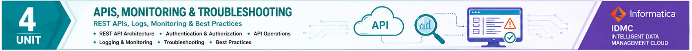

  

# UNIT 4

# Quiz (MCQs)

**Course Outcome:** CO4

**Total Questions:** 40

**Marks:** 40 × 1 = 40 Marks

---

## Question 1

REST stands for:

A. Remote Execution Standard Transfer

B. Representational State Transfer

C. Resource State Transmission

D. Representation System Transfer

**Answer:** B

---

## Question 2

REST APIs primarily communicate using:

A. FTP

B. SMTP

C. HTTP/HTTPS

D. SSH

**Answer:** C

---

## Question 3

Which principle states that each REST request is independent?

A. Resource Sharing

B. Stateless Communication

C. Session Persistence

D. Data Replication

**Answer:** B

---

## Question 4

Which HTTP method is used to retrieve data?

A. POST

B. GET

C. PUT

D. DELETE

**Answer:** B

---

## Question 5

Which HTTP method is generally used to create a new resource?

A. GET

B. POST

C. DELETE

D. PATCH

**Answer:** B

---

## Question 6

Which HTTP status code indicates successful execution?

A. 200

B. 401

C. 404

D. 500

**Answer:** A

---

## Question 7

Which status code indicates an unauthorized request?

A. 201

B. 401

C. 403

D. 500

**Answer:** B

---

## Question 8

Which data format is most commonly returned by REST APIs?

A. CSV

B. XML only

C. JSON

D. PDF

**Answer:** C

---

## Question 9

The primary purpose of API versioning is to:

A. Increase storage

B. Maintain compatibility while introducing improvements

C. Reduce network speed

D. Encrypt databases

**Answer:** B

---

## Question 10

For new developments, Informatica generally recommends:

A. Platform REST API Version 1

B. Platform REST API Version 2

C. Platform REST API Version 3

D. SOAP APIs only

**Answer:** C

---

## Question 11

Before accessing protected resources, a client must:

A. Restart the Runtime

B. Authenticate

C. Create a Schedule

D. Install Secure Agent

**Answer:** B

---

## Question 12

The Base URL is used to:

A. Authenticate users

B. Prefix subsequent API requests

C. Store logs

D. Configure Secure Agents

**Answer:** B

---

## Question 13

Which header commonly carries authentication information?

A. Accept

B. Content-Type

C. Authorization

D. Cache-Control

**Answer:** C

---

## Question 14

Which header specifies the request format?

A. Authorization

B. Content-Type

C. Host

D. Referer

**Answer:** B

---

## Question 15

The Runtime Environment API is used to retrieve:

A. Student records

B. Runtime information

C. Operating system details

D. Browser settings

**Answer:** B

---

## Question 16

Which API records administrative activities?

A. Runtime API

B. User API

C. Audit Log API

D. Organization API

**Answer:** C

---

## Question 17

Which API retrieves scheduled integration information?

A. User API

B. Runtime API

C. Schedule API

D. Asset API

**Answer:** C

---

## Question 18

Which API provides organizational information?

A. Organization API

B. Runtime API

C. Session API

D. Asset API

**Answer:** A

---

## Question 19

Which API is used to retrieve user details?

A. Runtime API

B. User API

C. Schedule API

D. Error API

**Answer:** B

---

## Question 20

Administrative REST APIs mainly help in:

A. Gaming

B. Administrative automation

C. Video editing

D. Image processing

**Answer:** B

---

## Question 21

A Session Log primarily records:

A. User passwords

B. Task execution details

C. Browser history

D. Firewall rules

**Answer:** B

---

## Question 22

Which log helps identify execution failures?

A. Success Log

B. Session Log

C. Error Log

D. Audit Report

**Answer:** C

---

## Question 23

Which log records successful execution?

A. Session Log

B. Success Log

C. Error Log

D. Runtime Log

**Answer:** B

---

## Question 24

Tomcat Logs are mainly useful for:

A. Payroll processing

B. Application server troubleshooting

C. Database normalization

D. User authentication only

**Answer:** B

---

## Question 25

A consistent log naming convention helps administrators:

A. Increase bandwidth

B. Locate logs quickly

C. Improve CPU speed

D. Create schedules

**Answer:** B

---

## Question 26

The IDMC Status Page displays:

A. Student attendance

B. Platform health and service availability

C. Database schema

D. Mapping code

**Answer:** B

---

## Question 27

Before troubleshooting a local issue, administrators should first check:

A. Keyboard settings

B. Browser cache

C. IDMC Status Page

D. Printer status

**Answer:** C

---

## Question 28

Which issue is commonly caused by invalid credentials?

A. Slow network

B. Authentication Failure

C. High CPU usage

D. Large data volume

**Answer:** B

---

## Question 29

Which issue may occur if a Secure Agent stops running?

A. Runtime Offline

B. Improved performance

C. Faster execution

D. Automatic scheduling

**Answer:** A

---

## Question 30

The first step in troubleshooting is to:

A. Restart the server immediately

B. Collect information

C. Delete log files

D. Reinstall IDMC

**Answer:** B

---

## Question 31

Root cause analysis aims to:

A. Hide the issue

B. Identify the underlying reason for the problem

C. Increase execution time

D. Create new users

**Answer:** B

---

## Question 32

Which practice helps prevent repeated issues?

A. Ignoring logs

B. Documenting incidents

C. Disabling monitoring

D. Deleting schedules

**Answer:** B

---

## Question 33

Which resource provides official product documentation?

A. Community Forum only

B. Official Informatica Documentation

C. Social Media

D. Email Archive

**Answer:** B

---

## Question 34

Which resource provides information about known platform incidents?

A. Runtime Environment

B. IDMC Status Page

C. Session Log

D. Schedule API

**Answer:** B

---

## Question 35

Using HTTPS primarily improves:

A. Storage capacity

B. Communication security

C. CPU performance

D. Report generation

**Answer:** B

---

## Question 36

A company wants to automate daily runtime monitoring. Which feature is most suitable?

A. REST API

B. Spreadsheet

C. Manual Reports

D. Local Text File

**Answer:** A

---

## Question 37

A failed scheduled job should first be investigated using:

A. Session and Error Logs

B. Image Viewer

C. Word Processor

D. Registry Editor

**Answer:** A

---

## Question 38

Which practice improves REST API security?

A. Sharing tokens publicly

B. Hard-coding passwords

C. Protecting authentication tokens

D. Disabling HTTPS

**Answer:** C

---

## Question 39

Which approach best supports enterprise administration?

A. Manual monitoring only

B. REST API automation with monitoring

C. No logging

D. Disable authentication

**Answer:** B

---

## Question 40

Which combination best supports reliable cloud administration?

A. REST APIs + Monitoring + Troubleshooting

B. FTP + Spreadsheet + Printer

C. Email + Browser + Calculator

D. PDF + Word Processor + Scanner

**Answer:** A

---

# Answer Key

| Q | Ans | Q | Ans | Q | Ans | Q | Ans |
|---|-----|---|-----|---|-----|---|-----|
|1|B|11|B|21|B|31|B|
|2|C|12|B|22|C|32|B|
|3|B|13|C|23|B|33|B|
|4|B|14|B|24|B|34|B|
|5|B|15|B|25|B|35|B|
|6|A|16|C|26|B|36|A|
|7|B|17|C|27|C|37|A|
|8|C|18|A|28|B|38|C|
|9|B|19|B|29|A|39|B|
|10|C|20|B|30|B|40|A|

---

# Topic Coverage

| Topic | Questions |
|---------|:--------:|
| REST API Fundamentals | 1–8 |
| API Versioning & Authentication | 9–14 |
| Administrative REST APIs | 15–20 |
| Log Analysis | 21–25 |
| Troubleshooting & IDMC Status Page | 26–35 |
| Enterprise Administration & Best Practices | 36–40 |

---

# End of Quiz